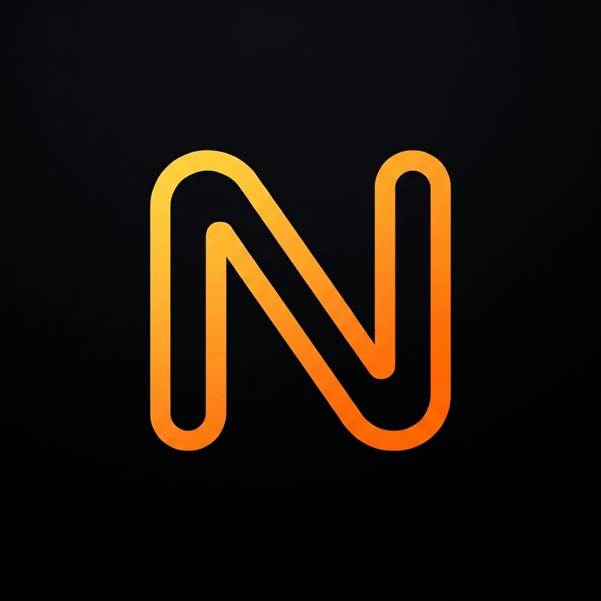
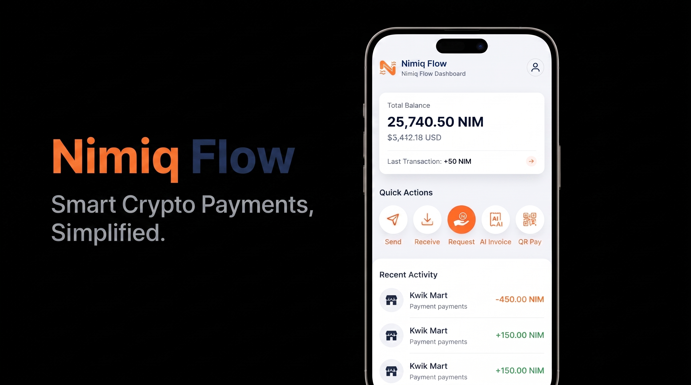
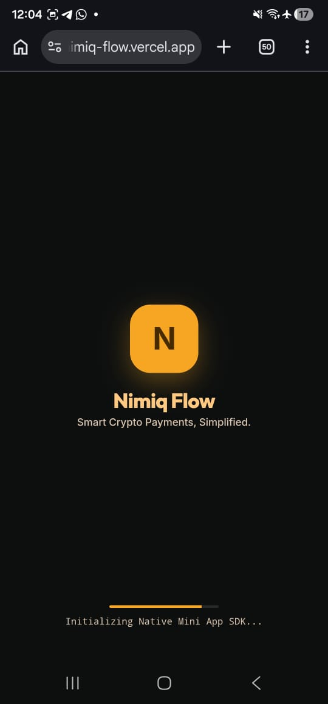
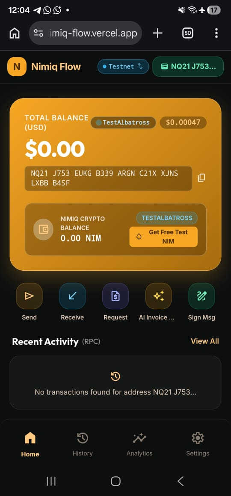
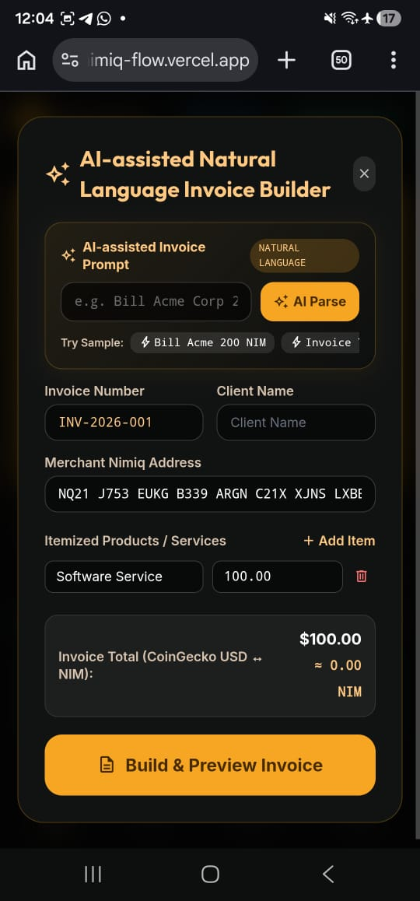
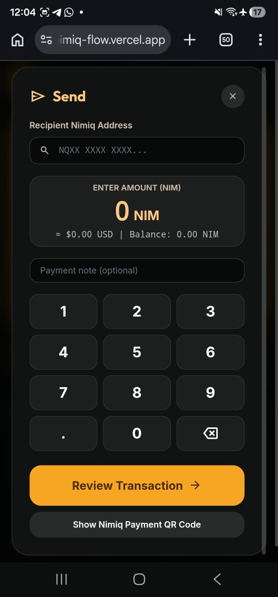
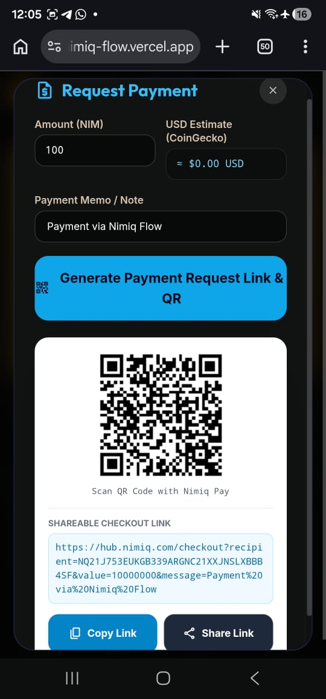

# NimiqFlow

> Smart Crypto Payments, Simplified.

| Field | Value |
| --- | --- |
| Category | Productivity |
| Pricing | Free |
| Team name | Nexora |
| Team members | _Not provided — optional_ |
| X account | 0xaje_ |
| Contact email | ajeseun11@gmail.com |
| GitHub login | @0xaje |
| Submitted at | 2026-07-31T23:11:35.659Z |

## Links

| Link | URL |
| --- | --- |
| Repo | [https://github.com/0xaje/-NimiqFlow-](<https://github.com/0xaje/-NimiqFlow->) |
| Demo | [https://nimiq-flow.vercel.app](<https://nimiq-flow.vercel.app>) |
| Video | [https://youtu.be/HSBxovGPej4?si=NJKhPL9zL06T5dq-](<https://youtu.be/HSBxovGPej4?si=NJKhPL9zL06T5dq->) |

## Description

Nimiq Flow is a Mini App for sending, receiving, requesting, and managing NIM payments with AI-powered invoicing and QR payments.

## Builder story

Nimiq Flow started from a simple observation: sending crypto is easy, but managing a complete payment workflow is not.

Freelancers, creators, and small businesses often have to switch between multiple tools to create invoices, generate payment requests, share wallet addresses, verify payments, and keep transaction records. That fragmented experience creates unnecessary friction, especially for users who simply want to get paid.

I wanted to build a Mini App that brings these essential payment tasks into one seamless experience inside Nimiq Pay.

Nimiq Flow was designed around a straightforward idea: one app, one workflow. A user should be able to create an invoice from natural language, generate a payment request, share it with a QR code or payment link, verify settlement on-chain, and export transaction records without leaving the app.

Throughout development, I focused on building a real product rather than a prototype. I integrated the native Nimiq Pay Mini App SDK for wallet interactions, connected to live blockchain data through Nimiq JSON-RPC, used real-time market pricing for conversions, and intentionally avoided mock blockchain transactions and simulated data.

I also paid close attention to usability. Features such as multilingual support, privacy-preserving device identification, address validation, native mobile sharing, and separate development and production environments were added to make the app practical for both users and developers.

Building Nimiq Flow has been an opportunity to explore how Mini Apps can make blockchain technology feel simpler and more useful. My goal wasn't to demonstrate isolated technical features, but to create a payment experience that solves real problems and showcases the potential of the Nimiq ecosystem.

This project represents my vision of making crypto payments more accessible, more intuitive, and easier to integrate into everyday workflows.

## Thumbnail

## Screenshots

---

_Generated from the submission form. `submission.yaml` in this folder is the machine-readable source of truth._
