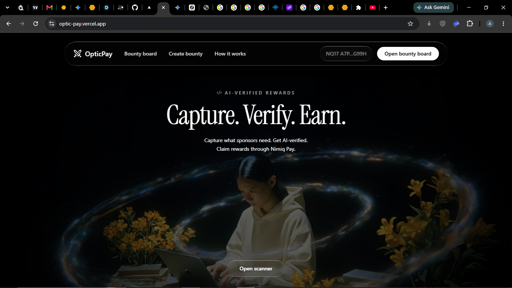
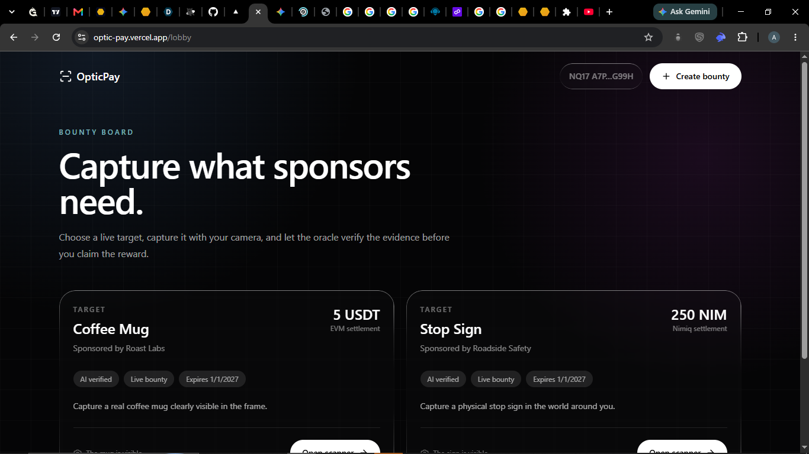
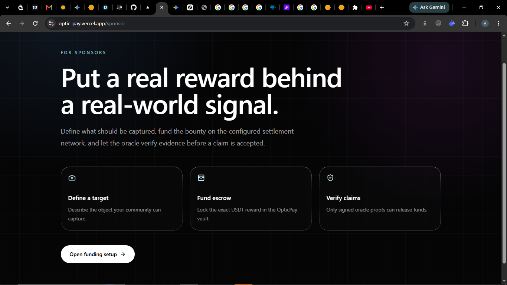

# OpticPay

> Ai verify payment

| Field | Value |
| --- | --- |
| Category | Earning |
| Pricing | Free |
| Team name | _Not provided — optional_ |
| Team members | _Not provided — optional_ |
| X account | _Not provided — optional_ |
| Contact email | alawodechristopherdolapo2020@gmail.com |
| GitHub login | @0xblaize |
| Submitted at | 2026-07-31T19:30:44.970Z |

## Links

| Link | URL |
| --- | --- |
| Repo | [https://github.com/0xblaize/OpticPay](<https://github.com/0xblaize/OpticPay>) |
| Demo | [https://optic-pay.vercel.app/](<https://optic-pay.vercel.app/>) |
| Video | [https://youtu.be/BUq3KoX4vV0](<https://youtu.be/BUq3KoX4vV0>) |

## Description

OpticPay is a decentralized bounty platform that uses an AI Vision oracle to automatically verify real-world photos and instantly release crypto payouts to users via smart contracts.

## Builder story

OpticPay is an AI-powered Web3 mini-app designed to seamlessly bridge real-world visual data with instant cryptocurrency micropayments. At its core, the platform allows sponsors—such as AI training companies, brands, or researchers—to lock funds into a smart contract escrow and create bounties for specific visual targets, like a coffee mug, a storefront, or a stop sign.

For the user, the experience is gamified, frictionless, and rewarding. Accessed natively through the Nimiq Pay mobile environment or a standard web browser, users browse available tasks, accept a challenge by checking in, and use their smartphone camera to capture a photo of the requested object.

The true innovation of OpticPay lies in its hybrid "AI Oracle" architecture. Instead of relying on slow, expensive human verification, the application routes the captured image to an advanced backend Vision API. This AI analyzes the photo in seconds to determine if it meets the sponsor's exact criteria. If the AI verifies the target is present, the server generates a secure, cryptographic signature.

This signature acts as a digital key. The user’s frontend automatically submits this proof to the OpticPay Vault smart contract (deployed on Polygon for USDT payouts). The contract mathematically verifies the oracle's signature and instantly releases the bounty directly into the user’s wallet. By combining Nimiq's seamless user experience, Polygon's low-fee infrastructure, and Web2 AI intelligence, OpticPay creates a fully automated, trustless economy for real-world actions.

## Thumbnail

## Screenshots

---

_Generated from the submission form. `submission.yaml` in this folder is the machine-readable source of truth._
