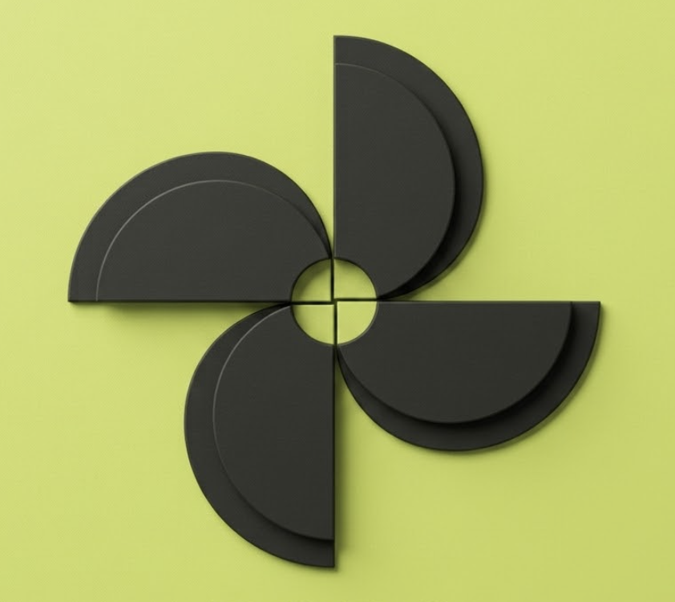
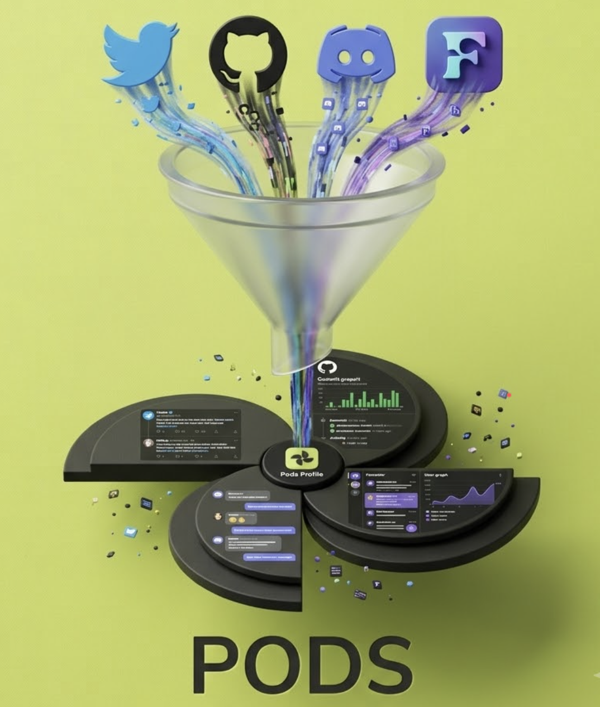
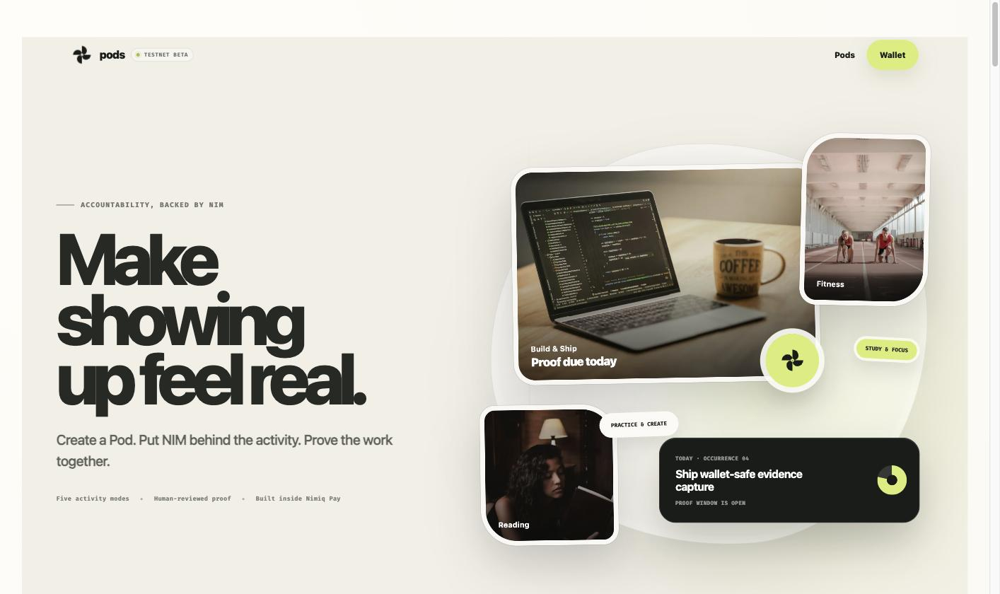
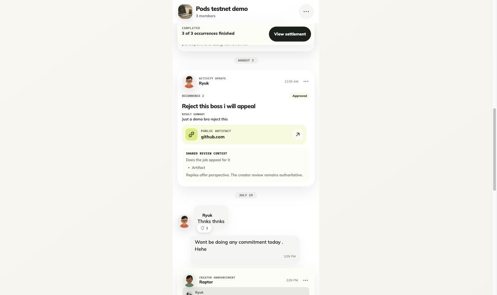
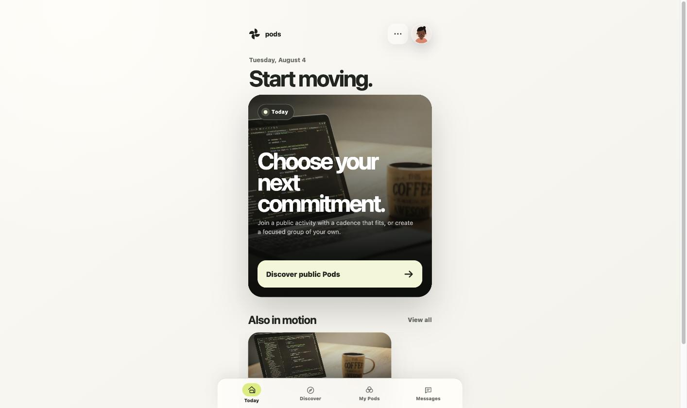

# Pods

> Commit, Show-up, Earn Repeat. Make showing up feel real.

| Field | Value |
| --- | --- |
| Category | Social |
| Pricing | Freemium |
| Team name | Podscasters |
| Team members | Kaushal Chaudhari |
| X account | abhinavpangaria |
| Contact email | abhinavpangaria2003@gmail.com |
| GitHub login | @18Abhinav07 |
| Submitted at | 2026-07-31T18:22:14.819Z |

## Links

| Link | URL |
| --- | --- |
| Repo | [https://github.com/18Abhinav07/Pods](<https://github.com/18Abhinav07/Pods>) |
| Demo | [https://pods-nimiq-activity.up.railway.app](<https://pods-nimiq-activity.up.railway.app>) |
| Video | [https://youtu.be/9ylVcZGGJKU](<https://youtu.be/9ylVcZGGJKU>) |

## Description

Pods is a NIM-backed accountability app for small groups on Nimiq Pay, commit NIM upfront, submit proof for scheduled activities like shipping code, fitness, reading or study, and get payouts proportional to your presence. Commit, Show-up, Earn, Repeat.

## Builder story

I've spent the last two and a half years in Web3, five-plus hackathons, some at big-stakes, reputable events, with recognition from major chains along the way. But after all those projects and hours, I hit a wall: I had no credible proof of what I'd actually executed. Nothing that said, with a straight face, "this is mine ( and yes I lost my previous startup on which i spent a year of my life on because of this ), and here's the discipline behind it."

Two things I've always been bad at: shipping consistently, and keeping up with daily habits like fitness. What I realized is that commitment only sticks when something real is on the line. That's the idea behind Pods, put NIM behind the activity, and let the stake do the work your willpower won't.

This submission is a starting point, not the ceiling. We're staying narrow on purpose: a community of builders and shippers first, with a clean enough integration surface that we think even student and campus communities will want to adopt it later. The direction we're building toward is an execution profile, not just a builder profile, every commitment and every piece of proof logged, so no one can take credit for your work but you, and your discipline is visible, not just claimed. From there, we want to plug into event organizers and hackathons directly, for individuals and teams. And for solo builders and small teams, the ones who ship hard and forget to tell anyone we want Pods to carry their project's visibility and timeline, so they can stay heads-down on the build instead of managing the socials.

## Thumbnail

## Screenshots

---

_Generated from the submission form. `submission.yaml` in this folder is the machine-readable source of truth._
