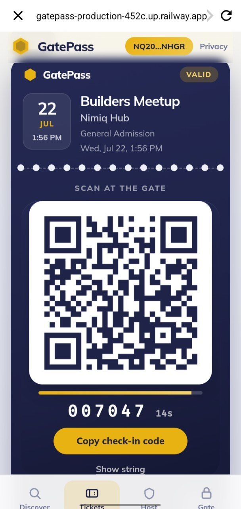
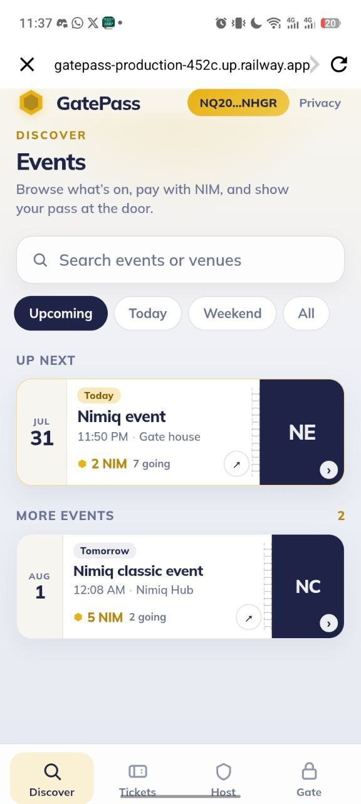
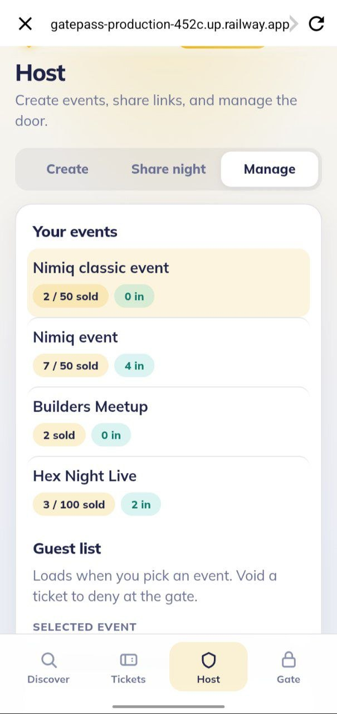
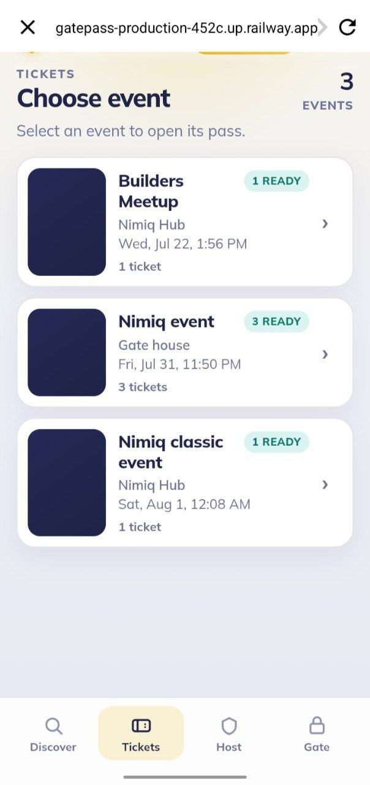
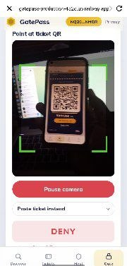

# GatePass

> NIM tickets. Rotating QR. Door check-in that actually works.

| Field | Value |
| --- | --- |
| Category | Lifestyle |
| Pricing | Free |
| Team name | _Not provided — optional_ |
| Team members | _Not provided — optional_ |
| X account | chrisgold__ |
| Contact email | chrisgoldog@gmail.com |
| GitHub login | @AshThunder |
| Submitted at | 2026-07-31T22:53:10.720Z |

## Links

| Link | URL |
| --- | --- |
| Repo | [https://github.com/ashThunder/gatepass](<https://github.com/ashThunder/gatepass>) |
| Demo | [https://gatepass-production-452c.up.railway.app/](<https://gatepass-production-452c.up.railway.app/>) |
| Video | [https://youtu.be/6ffvUGyHc6k?si=PtSouN3bTNBo3eUm](<https://youtu.be/6ffvUGyHc6k?si=PtSouN3bTNBo3eUm>) |

## Description

GatePass lets hosts sell event tickets in Nimiq Pay. Guests pay with NIM, get a rotating QR pass, and check in at the door,  built for meetups, workshops, and community nights.

## Builder story

Crypto events still run on PDF tickets and screenshot QR codes that anyone can copy. I wanted something that feels natural inside a payment wallet: create an event, pay in NIM, show a rotating QR at the door, and leave with proof you showed up.

GatePass is that loop. Hosts sell tickets in Nimiq Pay. Guests pay with NIM. Door staff scan a time-based QR that is hard to fake. After the event, checked-in guests get a proof of attendance badge.

Built for meetups, workshops, and community nights where you need tickets that work as well as the money that bought them.

## Thumbnail

## Screenshots

---

_Generated from the submission form. `submission.yaml` in this folder is the machine-readable source of truth._
