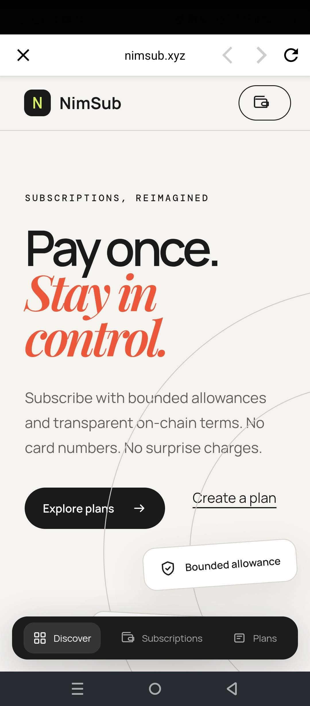
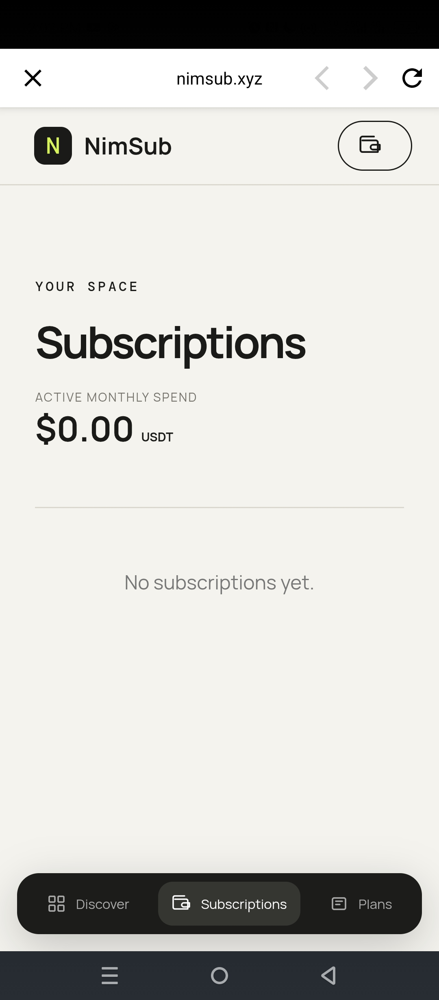
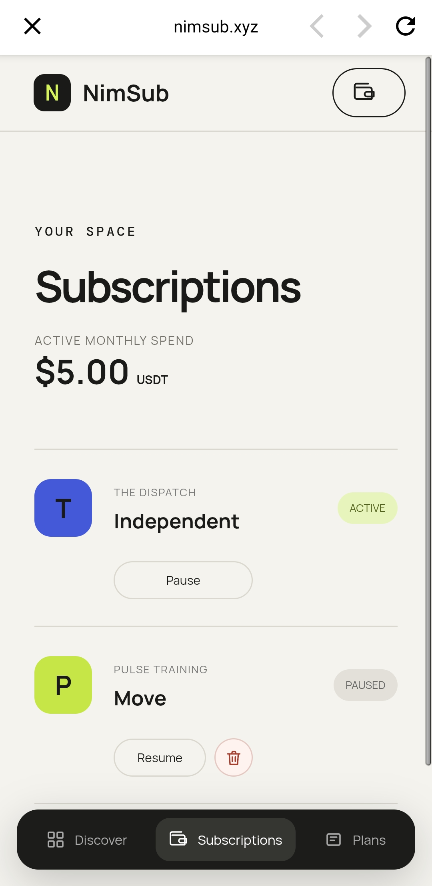
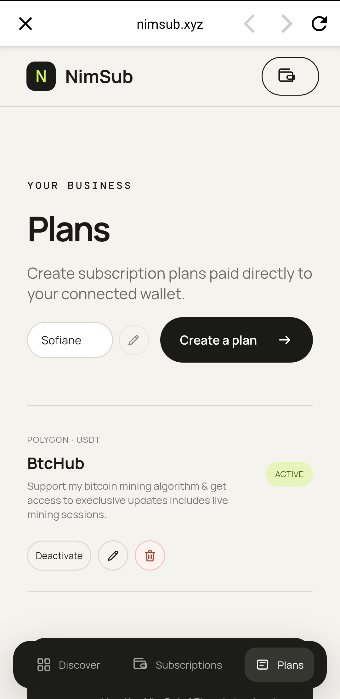
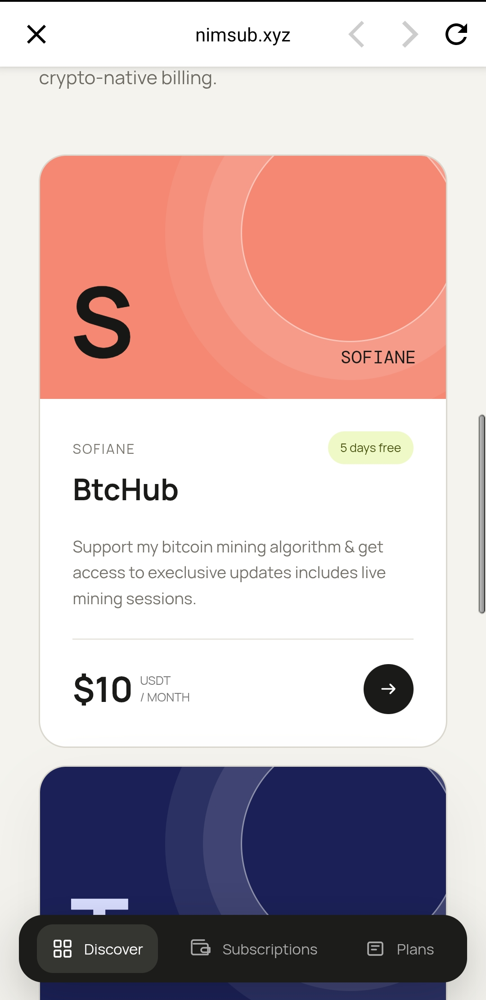

# NimSub

> Create, discover, and subscribe to USDT-powered subscription plans on Polygon.

| Field | Value |
| --- | --- |
| Category | Creator tools |
| Pricing | Free |
| Team name | _Not provided — optional_ |
| Team members | _Not provided — optional_ |
| X account | benra1sofian |
| Contact email | benrawane2012@gmail.com |
| GitHub login | @BenraouaneSoufiane |
| Submitted at | 2026-07-31T11:30:11.514Z |

## Links

| Link | URL |
| --- | --- |
| Repo | [https://github.com/benraouanesoufiane/NimSub](<https://github.com/benraouanesoufiane/NimSub>) |
| Demo | [https://nimsub.xyz](<https://nimsub.xyz>) |
| Video | [https://youtube.com/shorts/IBU9F5QqwVY](<https://youtube.com/shorts/IBU9F5QqwVY>) |

## Description

NimSub is a NimiqPay Mini App that enables anyone to create subscription plans, discover services, and subscribe with recurring USDT payments.

## Builder story

I saw web3 subscription apps are missed, first tried to build the proframable version through the sdk, but after receiving feedbacks, I removed the friction & enabled any connected wallet can create sub plans, discover & subscribe.

## Thumbnail

## Screenshots

---

_Generated from the submission form. `submission.yaml` in this folder is the machine-readable source of truth._
