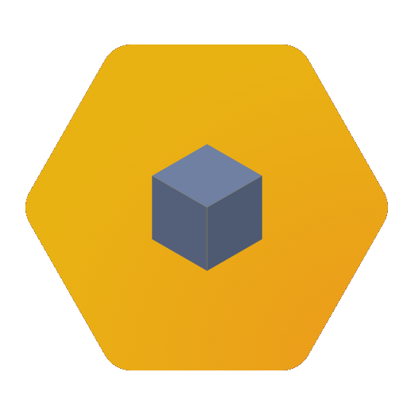
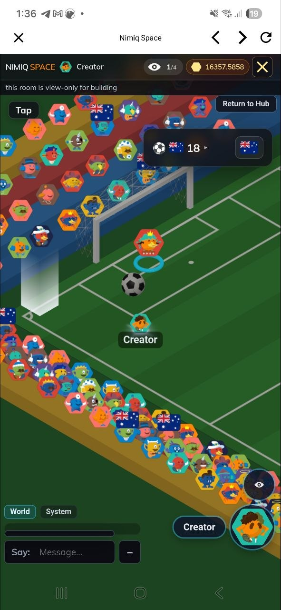
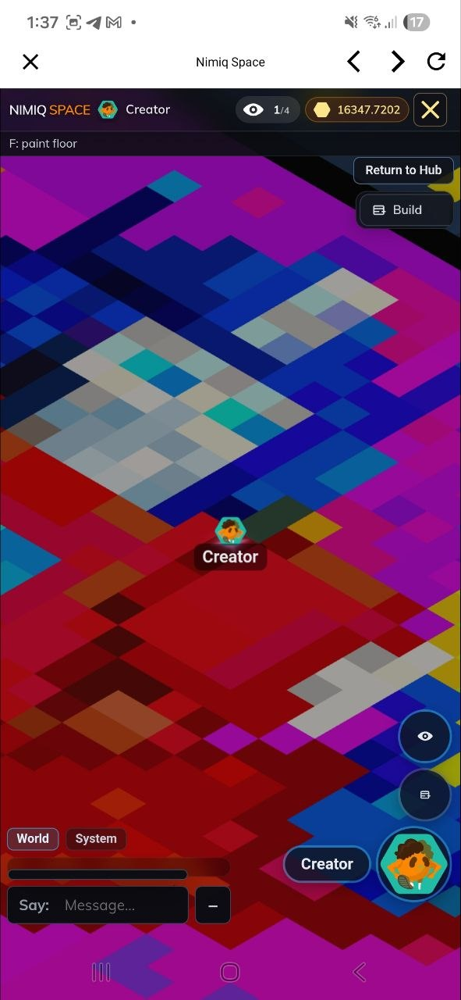
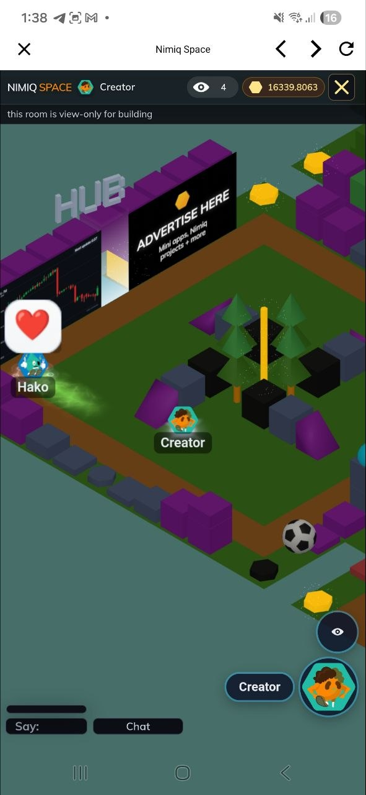

# Nimiq Space

> Social-first multiplayer sandbox, build, create, earn

| Field | Value |
| --- | --- |
| Category | Social |
| Pricing | Free |
| Team name | _Not provided — optional_ |
| Team members | _Not provided — optional_ |
| X account | nimiqspace |
| Contact email | nimiqspace@gmail.com |
| GitHub login | @Harlski |
| Submitted at | 2026-07-31T15:57:19.053Z |

## Links

| Link | URL |
| --- | --- |
| Repo | [https://github.com/harlski/nspace](<https://github.com/harlski/nspace>) |
| Demo | [https://nimiq.space](<https://nimiq.space>) |
| Video | [https://youtu.be/QWzrXwbqHvs](<https://youtu.be/QWzrXwbqHvs>) |

## Description

Nimiq Space is a multiplayer isometric social world where you explore shared rooms, build with others, play games & hang out.

Endless discoveries to be found, development is directed by real player feedback with a focus on fostering a strong social community.

## Builder story

I grew up on internet forums, the ability to communicate with others around the world over a common subject has been lost. I kind of miss this.

Chat apps like Telegram & Discord miss the mark, as it feels impersonal. Non-English speaking users are confined to their own single language only channels & there is rarely any cross communication between.

Nimiq Space fits a niche where users can see each other occupying a shared (Nimiq) space, indicating to others that "I'm here right now" which is encouraging for real life asyncronous communication. Accessibility features were implemented to allow for quick translating between languages.

Nimiq here is the common connection, any active users silently share this connection & can quickly socialize with others. There's a long way to go, but we've only just planted the seeds :)

## Thumbnail

## Screenshots

---

_Generated from the submission form. `submission.yaml` in this folder is the machine-readable source of truth._
