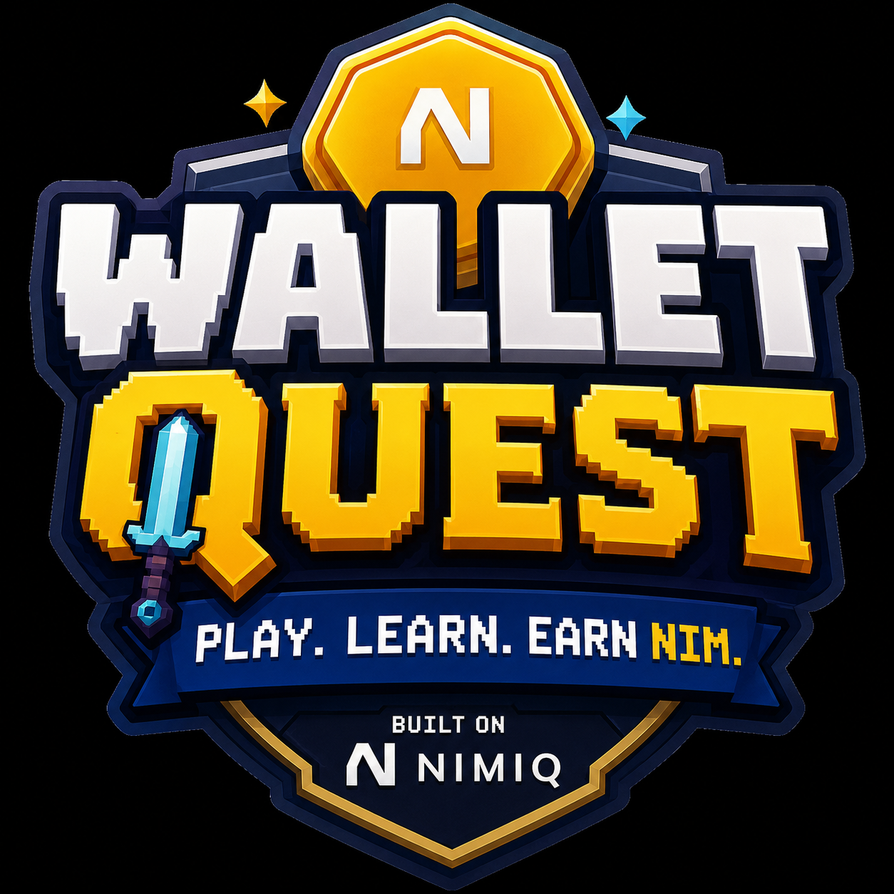
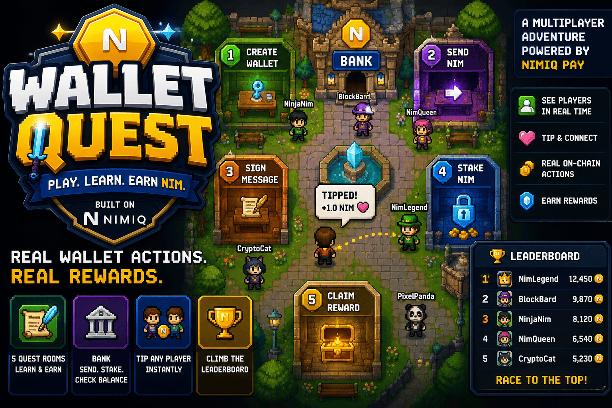
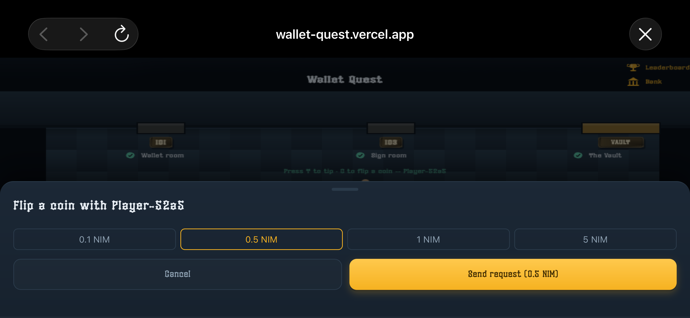
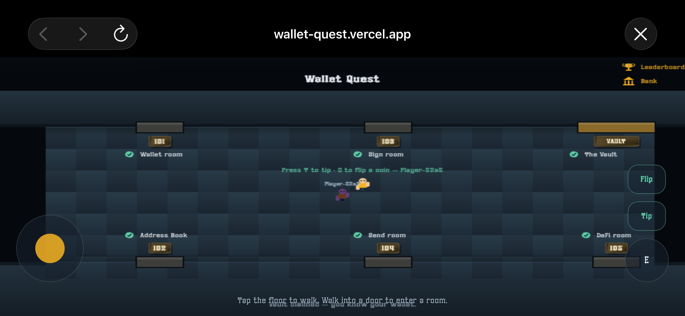
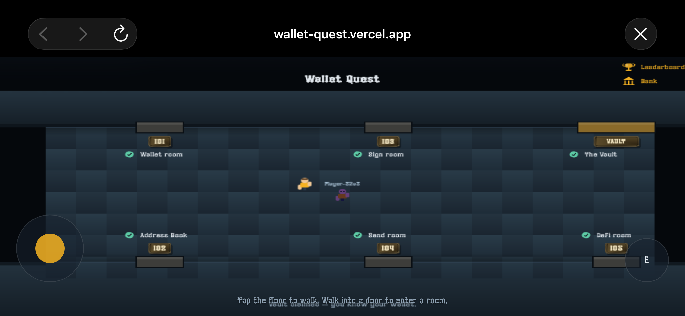
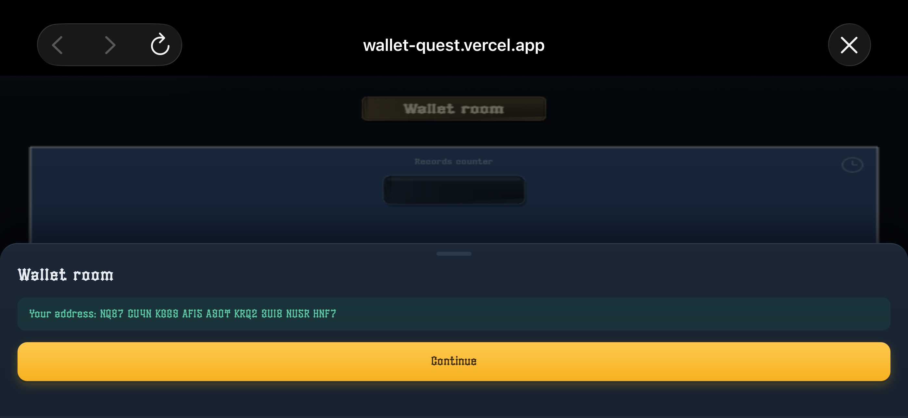
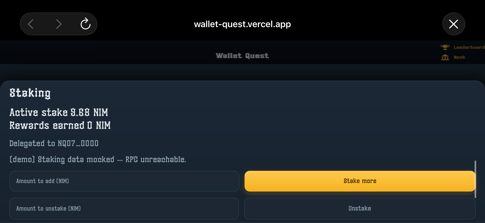

# Wallet quest

> You walk a character around a shared hub world where other players are visible in real time;

| Field | Value |
| --- | --- |
| Category | Games |
| Pricing | Free |
| Team name | _Not provided — optional_ |
| Team members | _Not provided — optional_ |
| X account | _Not provided — optional_ |
| Contact email | yungdynamic53@gmail.com |
| GitHub login | @Imdavyking |
| Submitted at | 2026-07-31T23:51:24.588Z |

## Links

| Link | URL |
| --- | --- |
| Repo | [https://github.com/Imdavyking/wallet-quest](<https://github.com/Imdavyking/wallet-quest>) |
| Demo | [https://wallet-quest.vercel.app/](<https://wallet-quest.vercel.app/>) |
| Video | [https://youtu.be/g8ZC4qFAtHM?si=BBC595AaE3eTWxqP](<https://youtu.be/g8ZC4qFAtHM?si=BBC595AaE3eTWxqP>) |

## Description

You walk a character around a shared hub world where other players are visible in real time; five rooms each teach one wallet concept and end in a real signed message or on-chain transaction;

## Builder story

_Not provided — optional_

## Thumbnail

## Screenshots

---

_Generated from the submission form. `submission.yaml` in this folder is the machine-readable source of truth._
