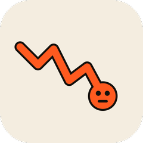
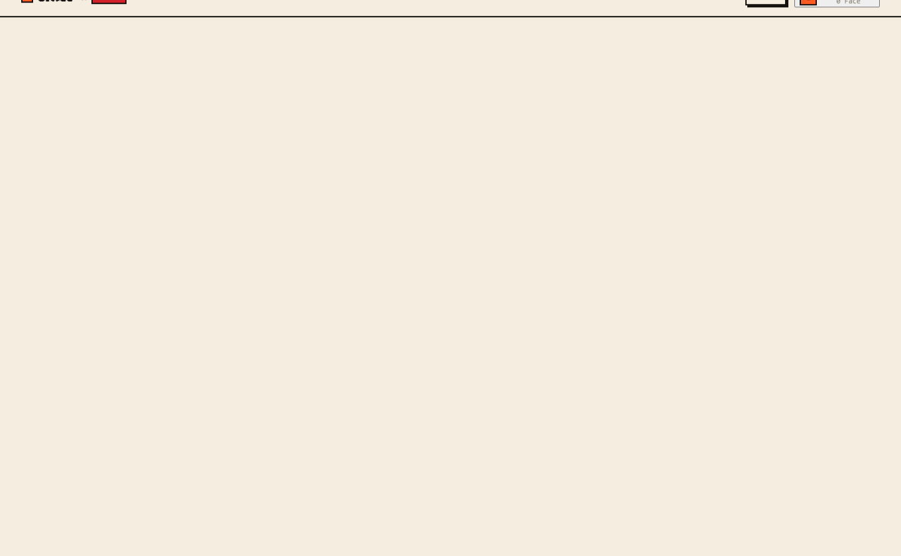
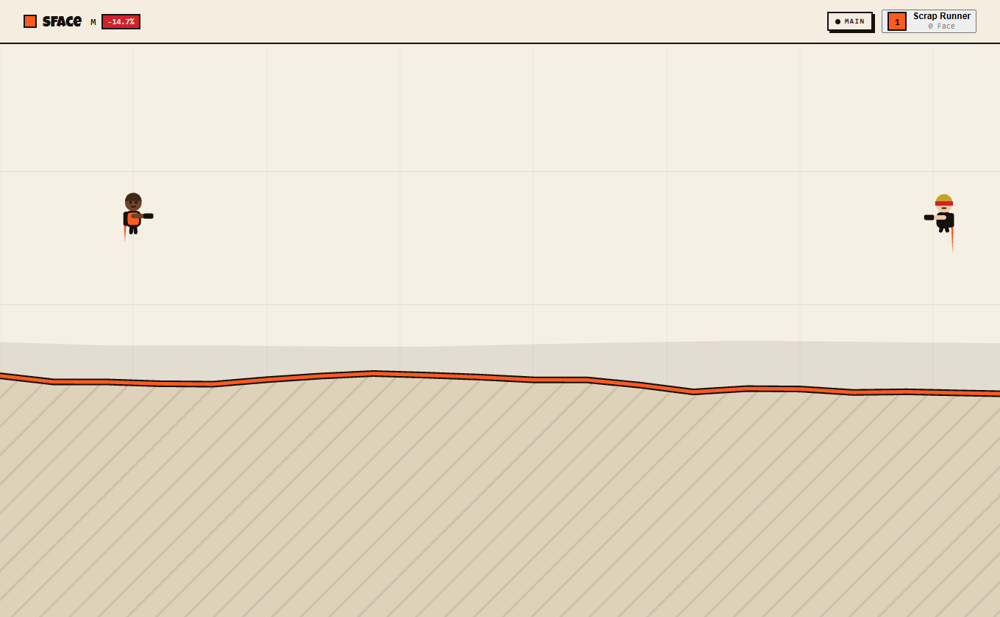
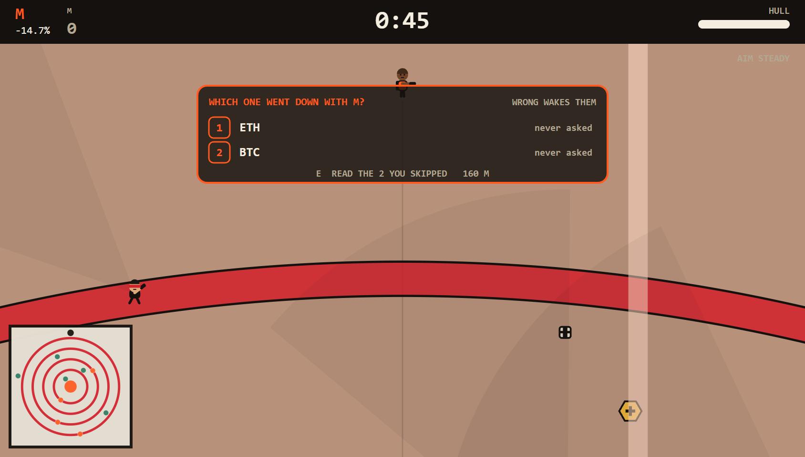
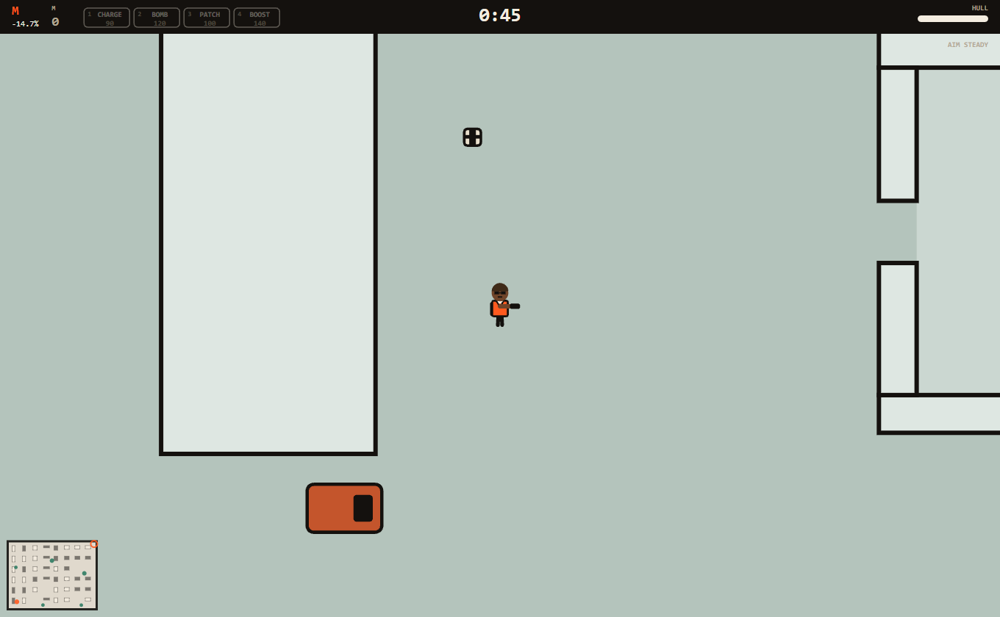
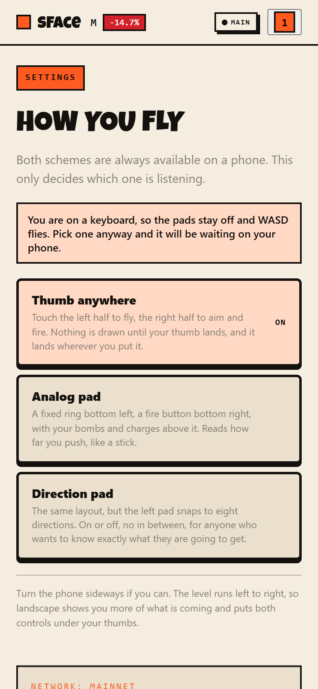

# sFace

> Crypto is down. Somebody has to save face.

| Field | Value |
| --- | --- |
| Category | Games |
| Pricing | Free |
| Team name | invincibles |
| Team members | Grachi |
| X account | grachidefi |
| Contact email | iziedking17@gmail.com |
| GitHub login | @Iziedking |
| Submitted at | 2026-07-31T21:08:41.513Z |

## Links

| Link | URL |
| --- | --- |
| Repo | [https://github.com/Iziedking/sFace](<https://github.com/Iziedking/sFace>) |
| Demo | [https://sface.site](<https://sface.site>) |
| Video | [https://vimeo.com/1214702787](<https://vimeo.com/1214702787>) |

## Description

Each day the worst performer in the top 100 becomes a playable level: its real a 24-hour chart is the terrain, and the people trapped in it are whoever crypto X spent that day arguing about. It is for anyone who follows the market and would rather play the news than ignore it.

## Builder story

Crypto has spent this cycle losing things. Projects winding down, tokens going to nothing, exchanges closing, and every week another post explaining why it was always going to happen. Four companies filed or wound down in one seven day stretch while I was building this. The mood is not that people lost money. It is that people stopped expecting anything.

I did not want to write another thread about it. I wanted to make the thing you would rather look at. So sFace takes the worst chart of the day, the actual one, and makes you fly it. The wreck you are pulling people out of is the market being down. The people you are pulling out are the accounts that were arguing about it hours earlier, with
their real posts and real links. Stage six hands you four things that genuinely went out today and asks which one explains the day. You end up caught up on crypto Twitter by playing, which is a better deal than doom scrolling and calling it research.

The clans came from watching how people actually survive a bad market, which is in group chats with the same fifteen mutuals. Pull your closest ones into a tag,
pool your Face, take a run at another clan. Stake a friend on the exact same seed and settle it in NIM, wallet to wallet.

The ending pulls the camera back until today is a notch on a long climb. Two trillion market cap is still early. That is the only thing the game argues, and it waits until you have earned it.

## Thumbnail

## Screenshots

---

_Generated from the submission form. `submission.yaml` in this folder is the machine-readable source of truth._
