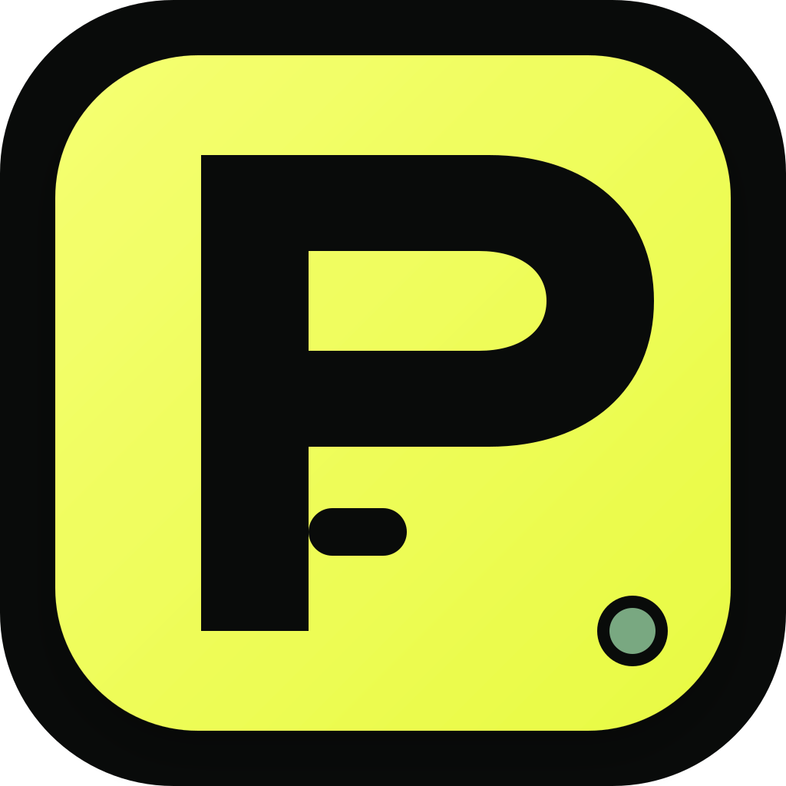
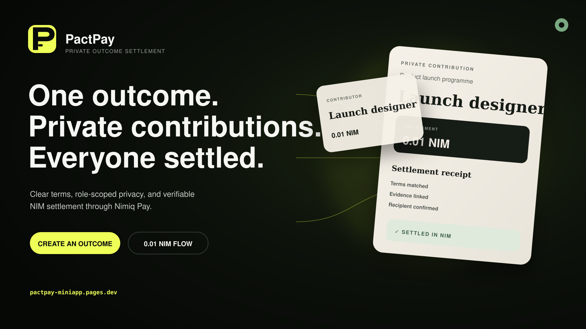
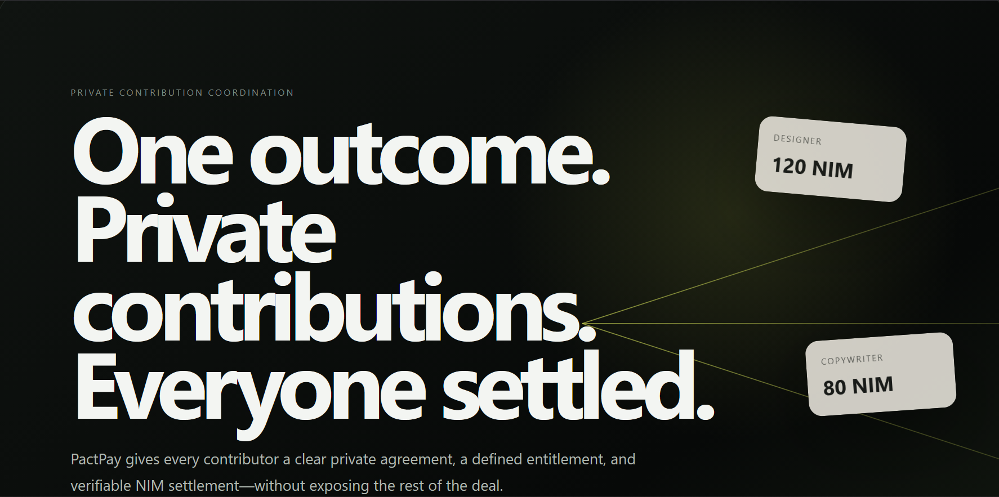
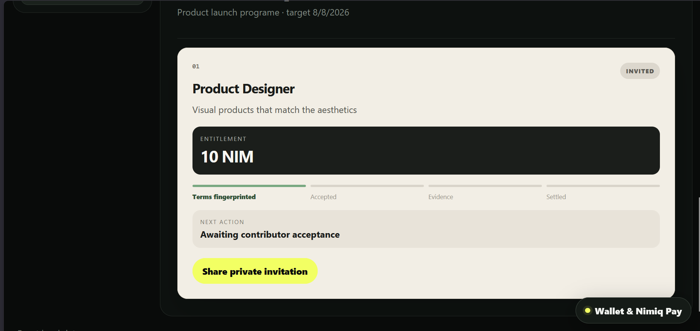
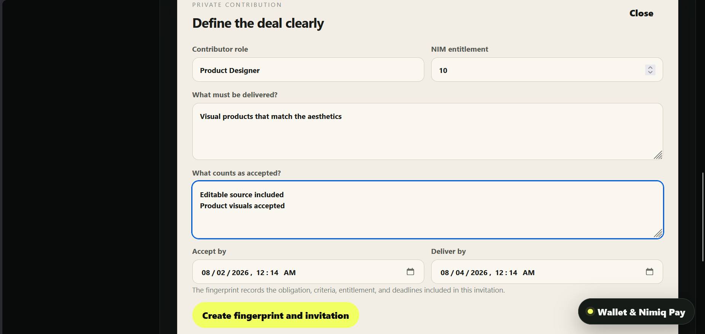

# PactPay

> One outcome. Private contributions. Everyone settled in NIM.

| Field | Value |
| --- | --- |
| Category | Productivity |
| Pricing | Free |
| Team name | _Not provided — optional_ |
| Team members | Solo - Jay |
| X account | Jaydearcadian |
| Contact email | supremacy817@gmail.com |
| GitHub login | @Jaydearcadian |
| Submitted at | 2026-07-31T23:59:00.394Z |

## Links

| Link | URL |
| --- | --- |
| Repo | [https://github.com/Jaydearcadian/pactpay-miniapp](<https://github.com/Jaydearcadian/pactpay-miniapp>) |
| Demo | [https://pactpay-miniapp.pages.dev/](<https://pactpay-miniapp.pages.dev/>) |
| Video | [https://youtu.be/4OIMRotxoPU](<https://youtu.be/4OIMRotxoPU>) |

## Description

PactPay helps a coordinator define private, role-scoped contributions, share clear terms, receive evidence, and settle each contributor directly in NIM through Nimiq Pay. Every contributor sees only their own obligation, entitlement, deadlines, and receipt.

## Builder story

_Not provided — optional_

## Thumbnail

## Screenshots

---

_Generated from the submission form. `submission.yaml` in this folder is the machine-readable source of truth._
