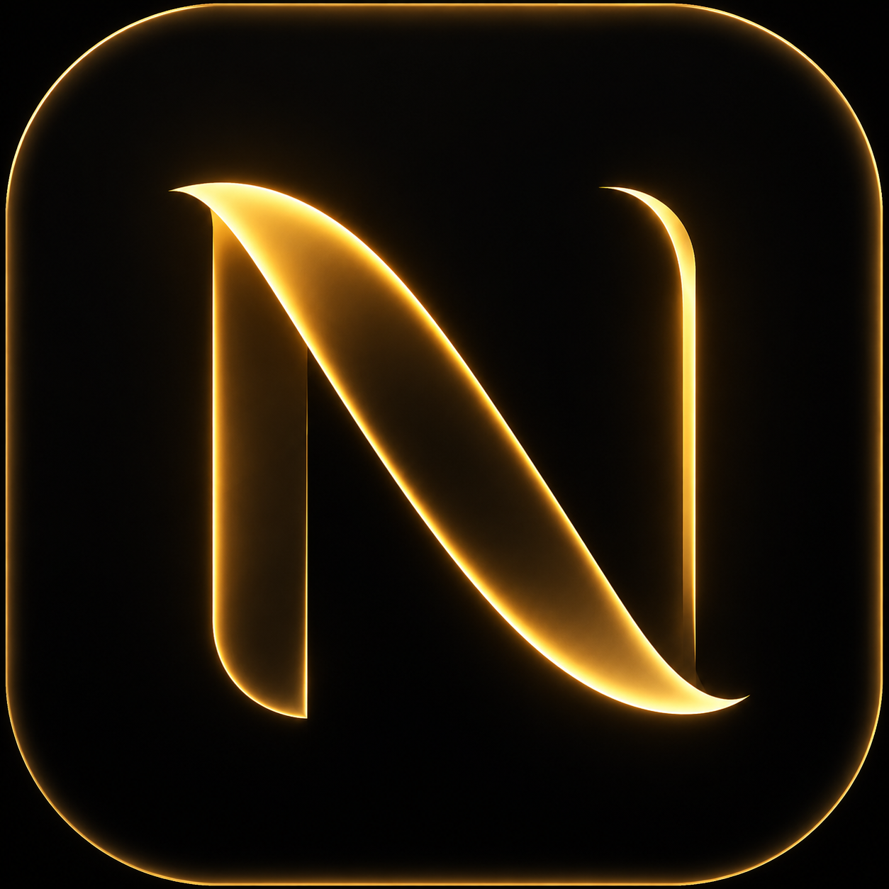
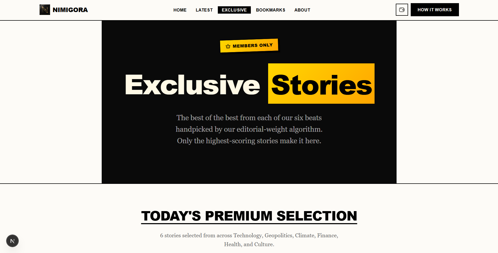
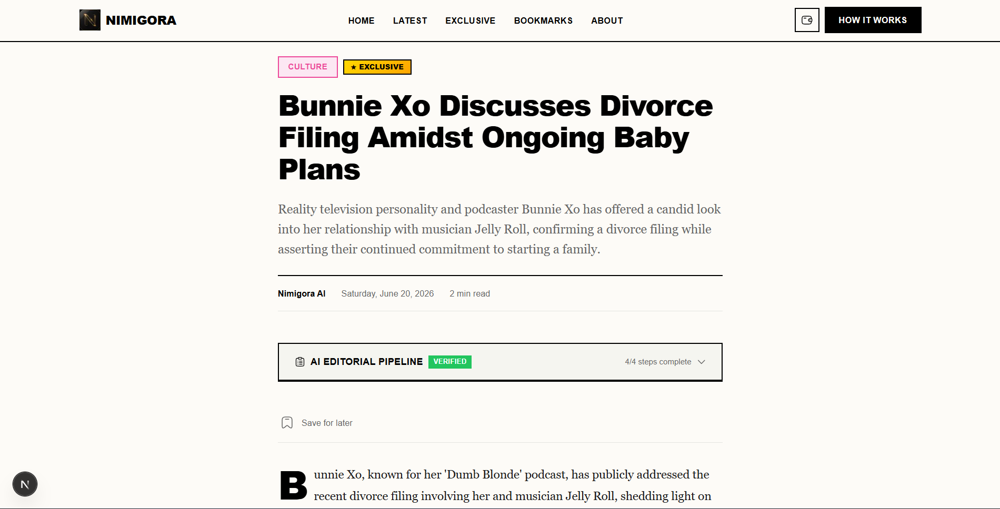
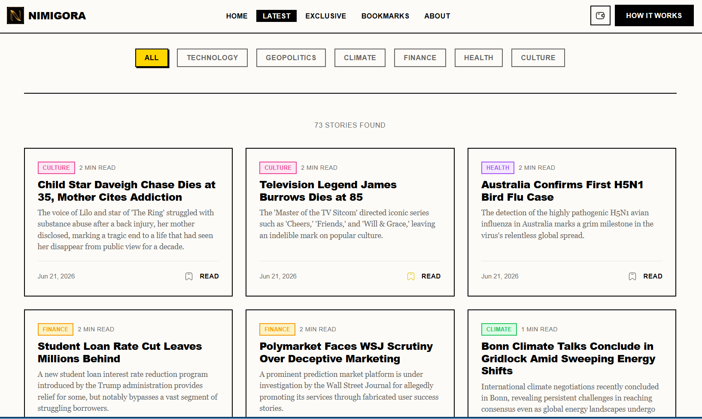

# Nimigora

> The Autonomous Newsroom

| Field | Value |
| --- | --- |
| Category | Lifestyle |
| Pricing | Freemium |
| Team name | Nimigora |
| Team members | _Not provided — optional_ |
| X account | x.com/KehnMarv |
| Contact email | marvellousegemonye@gmail.com |
| GitHub login | @Kehn-Marv |
| Submitted at | 2026-07-29T22:57:02.164Z |

## Links

| Link | URL |
| --- | --- |
| Repo | [https://github.com/Kehn-Marv/Nimigora](<https://github.com/Kehn-Marv/Nimigora>) |
| Demo | [https://nimigora.vercel.app/](<https://nimigora.vercel.app/>) |
| Video | [https://x.com/Nimigora_web](<https://x.com/Nimigora_web>) |

## Description

Experience the future of news. Nimigora uses an autonomous AI pipeline to deliver unbiased, fact-checked journalism across global affairs, tech, and more.

## Builder story

The Problem: The modern news ecosystem is broken. It is plagued by clickbait, human bias, and increasingly, hallucinated "AI slop" designed just to farm clicks. 

Producing high-quality, deeply researched journalism is incredibly expensive and slow. As a result, publications are forced to rely on intrusive, ad-heavy interfaces or clunky subscription models that create massive friction for readers.

The Inspiration & Solution: I was inspired to build Nimigora to prove that an autonomous AI pipeline can actually operate with the rigorous standards of a premium human newsroom. 
Nimigora is an AI-native news experiment that independently researches, cross-references, fact-checks, and synthesizes global news into high-quality, bias-free articles across six different beats.

However, a premium product needs a premium monetization model. 
The Nimiq Pay Mini Apps framework was the missing piece of the puzzle. By integrating Nimiq Pay, Nimigora completely removes the friction of traditional web2 paywalls. 

Users can instantly unlock exclusive, deeply-researched content using seamless crypto micro-transactions right from their wallet.

Nimigora is my attempt to showcase the future of publishing: zero humans in the newsroom, zero bias in the writing, and zero friction in the payment.

## Thumbnail

## Screenshots

---

_Generated from the submission form. `submission.yaml` in this folder is the machine-readable source of truth._
