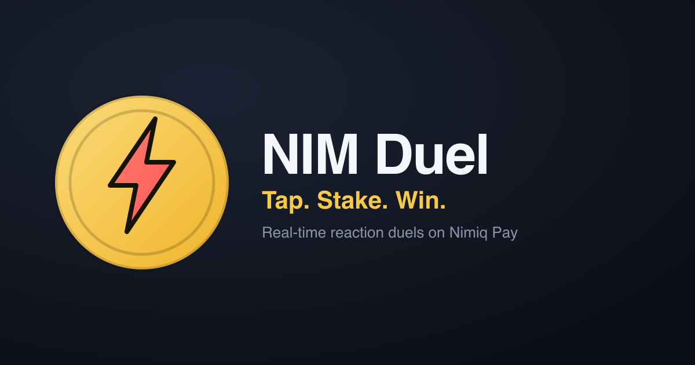
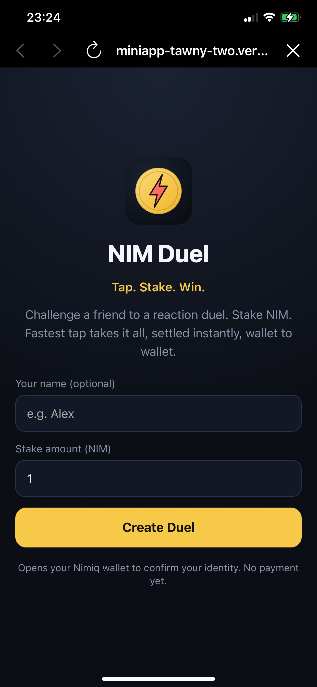
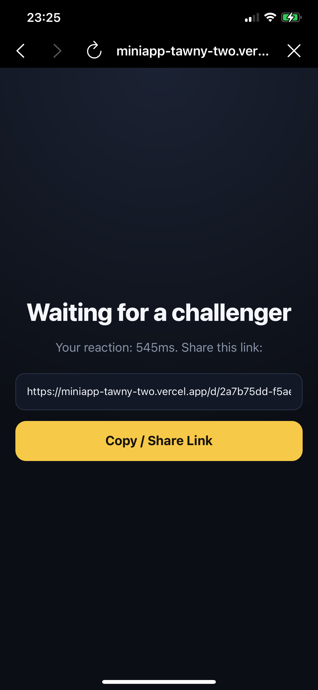
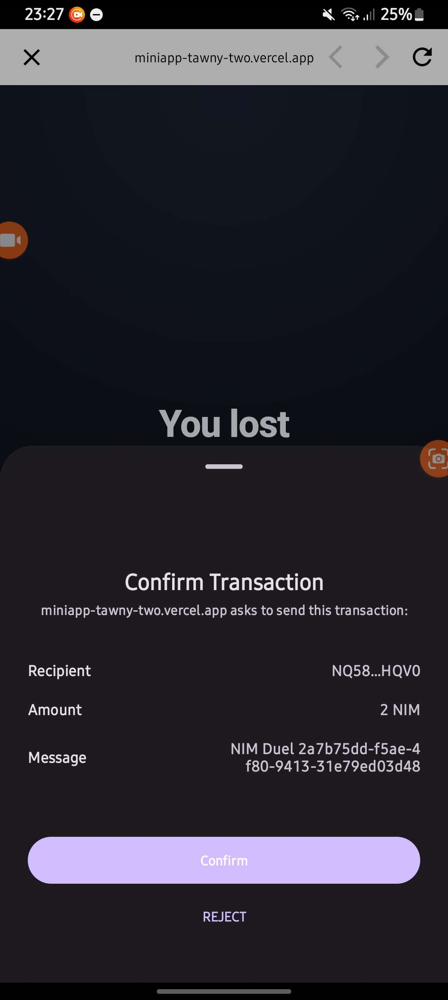
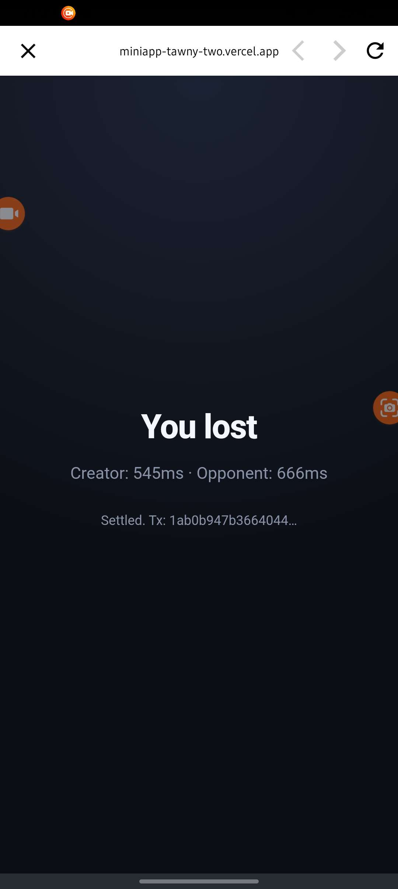
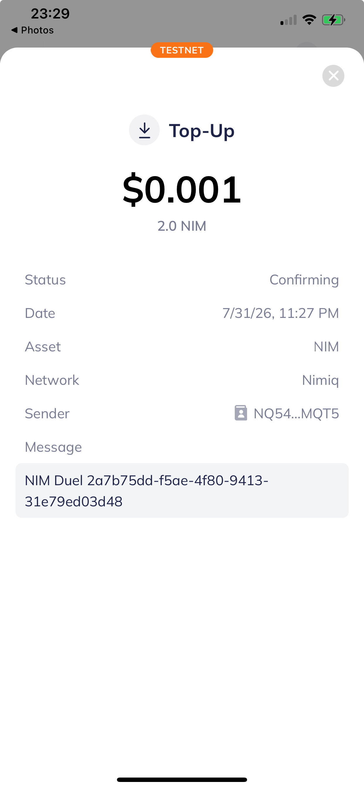

# NIM Duel

> Tap. Stake. Win.

| Field | Value |
| --- | --- |
| Category | Games |
| Pricing | Free |
| Team name | Nil |
| Team members | Nil |
| X account | EmmanuelAje7 |
| Contact email | ajeemmanuel221@gmail.com |
| GitHub login | @Nailer |
| Submitted at | 2026-07-31T22:34:28.784Z |

## Links

| Link | URL |
| --- | --- |
| Repo | [https://github.com/Nailer/nim-duel](<https://github.com/Nailer/nim-duel>) |
| Demo | [https://miniapp-tawny-two.vercel.app/](<https://miniapp-tawny-two.vercel.app/>) |
| Video | [https://youtube.com/shorts/GSCiJmWSQOo](<https://youtube.com/shorts/GSCiJmWSQOo>) |

## Description

Real-time reaction duels where two players stake NIM and the fastest tap wins — settled instantly wallet-to-wallet, no escrow, no house. Built for friends who want real stakes behind "I'm faster than you."

## Builder story

Reflex challenges between friends are never backed by anything real — NIM Duel fixes that. Two players stake NIM, tap for speed, and the loser's wallet pays the winner directly the moment the match resolves — no escrow, no custody, just two wallets and one transaction. A duel link isn't just a share, it's a dare.

## Thumbnail

## Screenshots

---

_Generated from the submission form. `submission.yaml` in this folder is the machine-readable source of truth._
