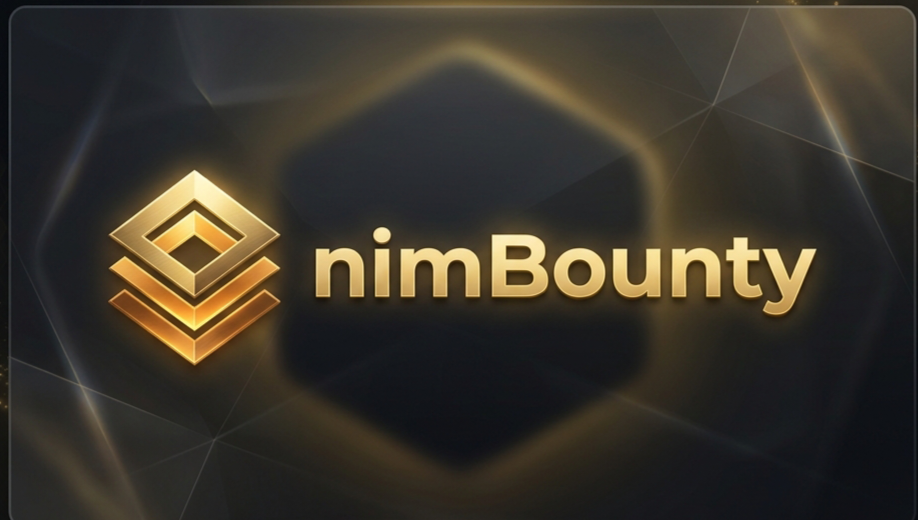
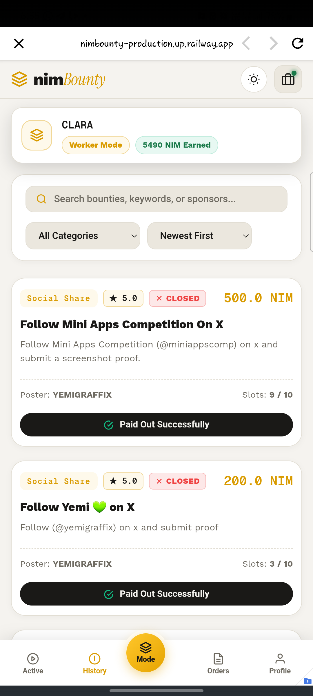
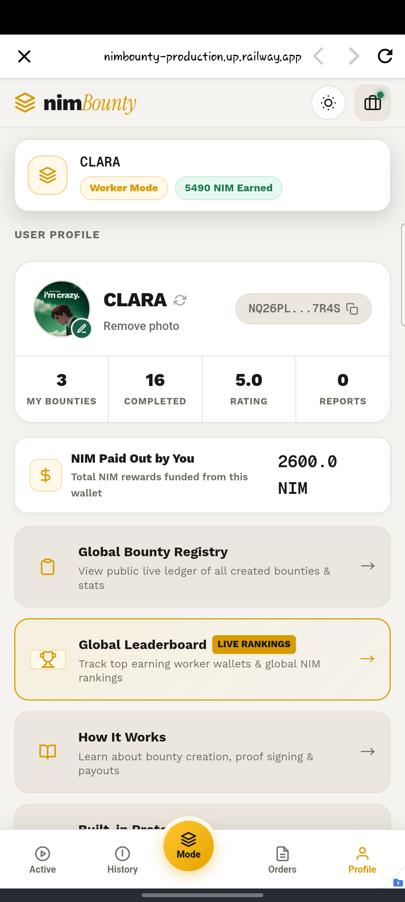
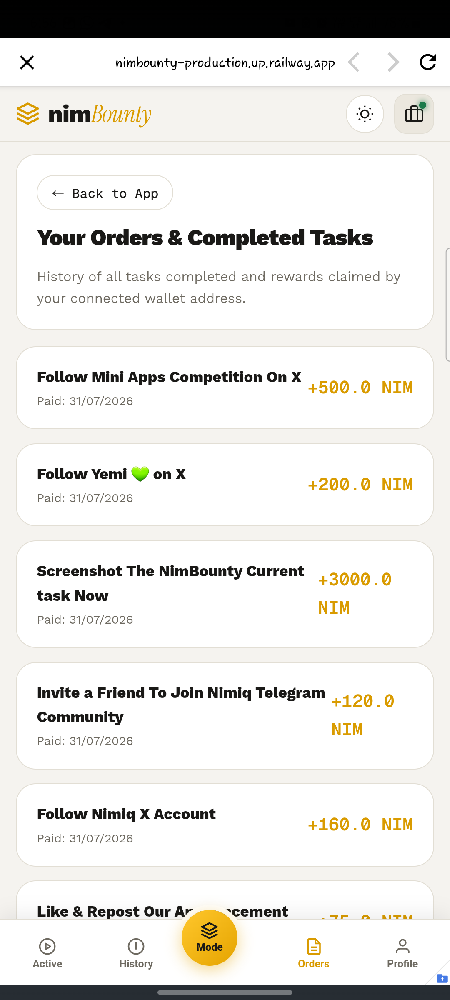
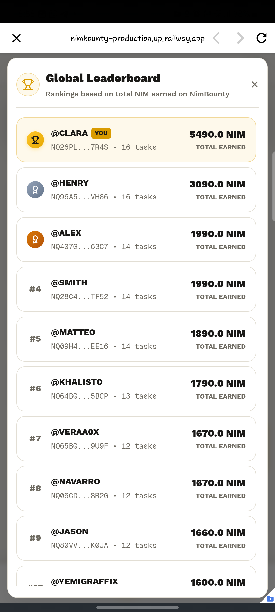
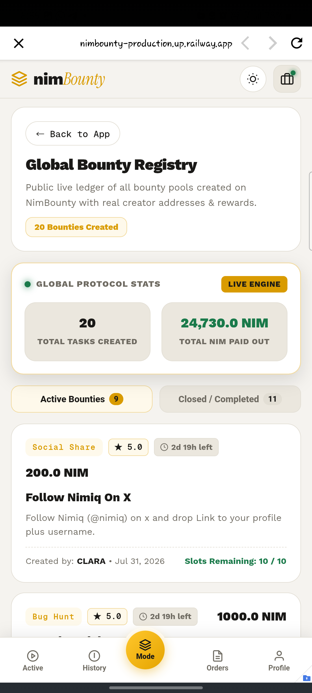

# NimBounty

> Outcome-based micro-task bounties on Nimiq Pay

| Field | Value |
| --- | --- |
| Category | Earning |
| Pricing | Free |
| Team name | _Not provided — optional_ |
| Team members | _Not provided — optional_ |
| X account | yemigraffix |
| Contact email | opeyemimosesawt@gmail.com |
| GitHub login | @OpeyemiMoses |
| Submitted at | 2026-07-31T18:41:24.413Z |

## Links

| Link | URL |
| --- | --- |
| Repo | [https://github.com/OpeyemiMoses/NimBounty](<https://github.com/OpeyemiMoses/NimBounty>) |
| Demo | [https://nimbounty-production.up.railway.app](<https://nimbounty-production.up.railway.app>) |
| Video | [https://youtu.be/45EQO1JdKiw?si=sgTl_ix557py5Ex5](<https://youtu.be/45EQO1JdKiw?si=sgTl_ix557py5Ex5>) |

## Description

NimBounty is an outcome-based micro-task bounty engine where Task creators publish bounty campaigns and workers performs them. it's made for Project Creators & Developers , Web3 founders, indie devs, and community managers who need real human QA. also for people looking to earn..

## Builder story

What inspired me to build this?
Existing Web2 micro-task platforms like Fiverr and Mechanical Turk are fundamentally broken for small tasks—they charge high 15%–20% commissions, require lengthy payout waiting periods, and enforce high minimum withdrawal limits.

On the flip side, Web3 bounty platforms often fail on mobile due to high gas costs for simple proof submissions and heavy bot manipulation, where automated scripts farm reward pools before real humans can participate.

I wanted to leverage Nimiq Pay's fast, zero-friction payment architecture to build a mobile-first, bot-resistant gig engine where creators get genuine human feedback and workers get paid instantly for their effort.

What problems does NimBounty solve?
Hardware-Bound Anti-Sybil Protection: Integrates Nimiq Pay’s requestDeviceIdentifier API, binding each worker to a unique physical device to block multi-account bot farms from draining bounty pools.
Seamless Mobile-First UX: Optimized specifically for the Nimiq Pay Mini App environment..

Instant Payout: The one click payment method helps NimBounty workflow become seamless. posters can just easily approve a workers proof and send payment immediately.. also on shipping V2 we'll introduce Excrows who'll handle the payments directly without the need of poster signing a transaction.  posters/bounty creators will just send the tokens to the Excrow vault and it'll release once the approve the workers proof.

## Thumbnail

## Screenshots

---

_Generated from the submission form. `submission.yaml` in this folder is the machine-readable source of truth._
