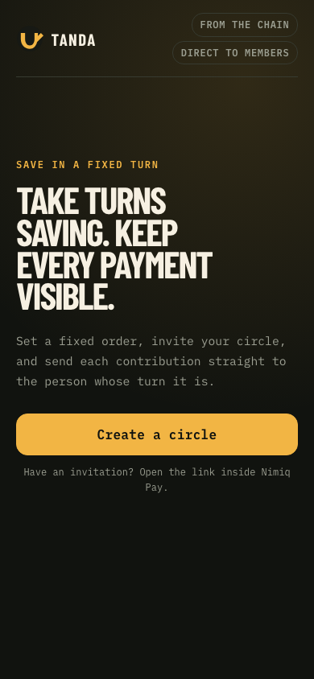
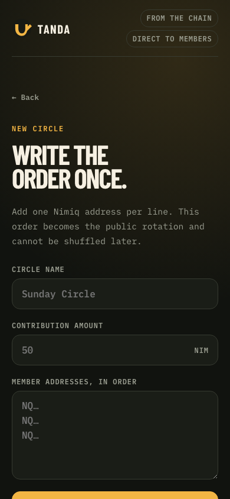
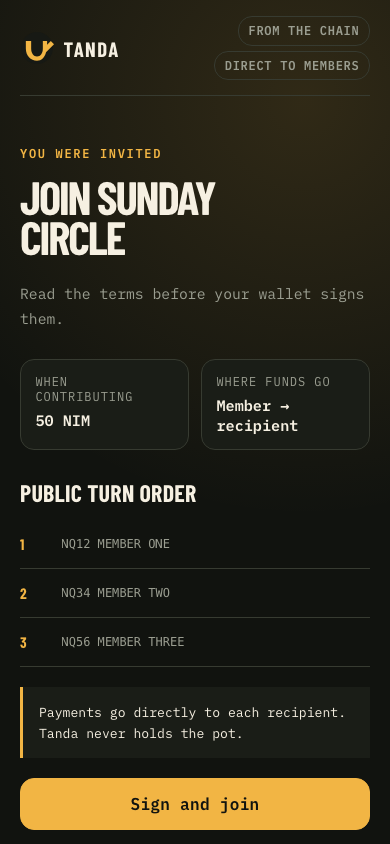

# Tanda

> Tanda coordinates a fixed rotating savings circle without holding its money.

| Field | Value |
| --- | --- |
| Category | Earning |
| Pricing | Free |
| Team name | _Not provided — optional_ |
| Team members | _Not provided — optional_ |
| X account | curioswhispers |
| Contact email | mykdahunsi@gmail.com |
| GitHub login | @ajanaku1 |
| Submitted at | 2026-07-31T17:56:38.623Z |

## Links

| Link | URL |
| --- | --- |
| Repo | [https://github.com/ajanaku1/Tanda](<https://github.com/ajanaku1/Tanda>) |
| Demo | [https://tanda-one.vercel.app/](<https://tanda-one.vercel.app/>) |
| Video | [https://youtu.be/QTPNuvqGnA8](<https://youtu.be/QTPNuvqGnA8>) |

## Description

A rotating savings circle gives each member one turn to receive the group’s
contributions. Tanda records the circle name, contribution amount, and fixed
turn order in its invitation link. Members sign those terms in Nimiq Pay or
the Nimiq web wallet.

## Builder story

_Not provided — optional_

## Thumbnail

## Screenshots

---

_Generated from the submission form. `submission.yaml` in this folder is the machine-readable source of truth._
