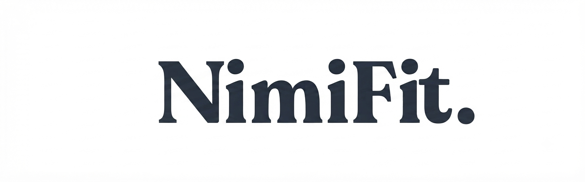
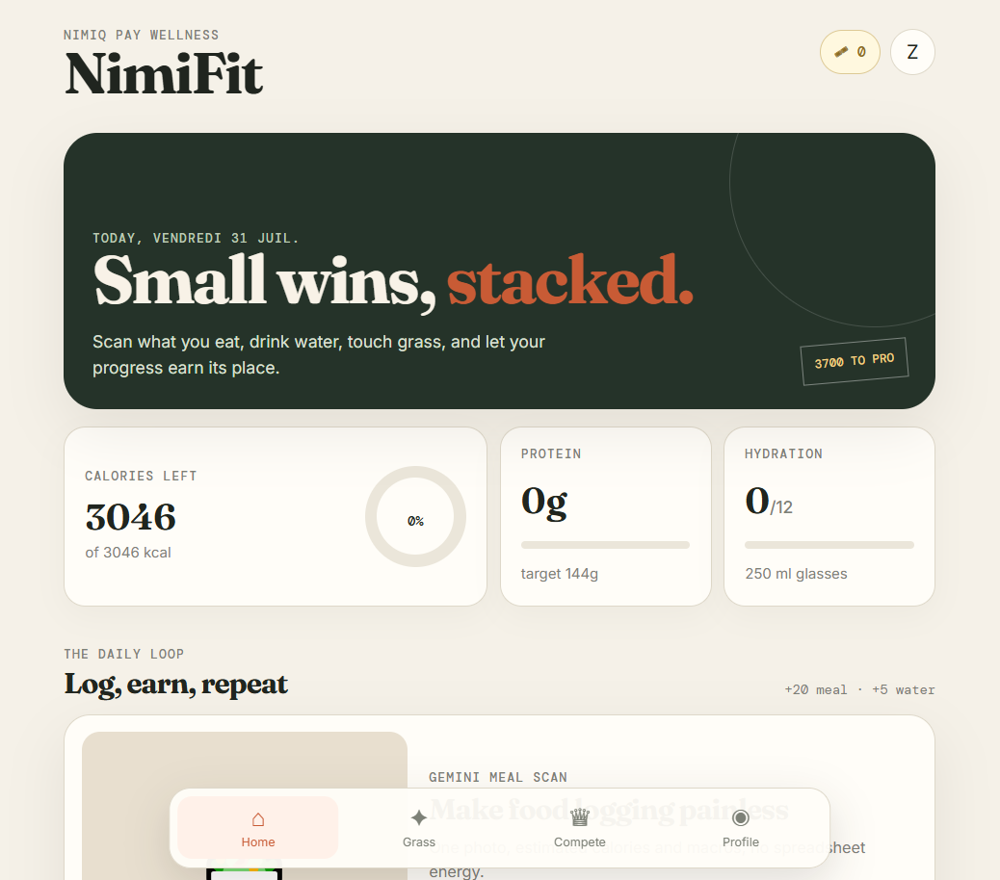
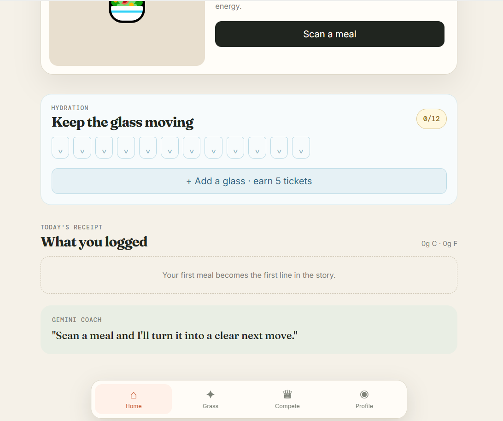
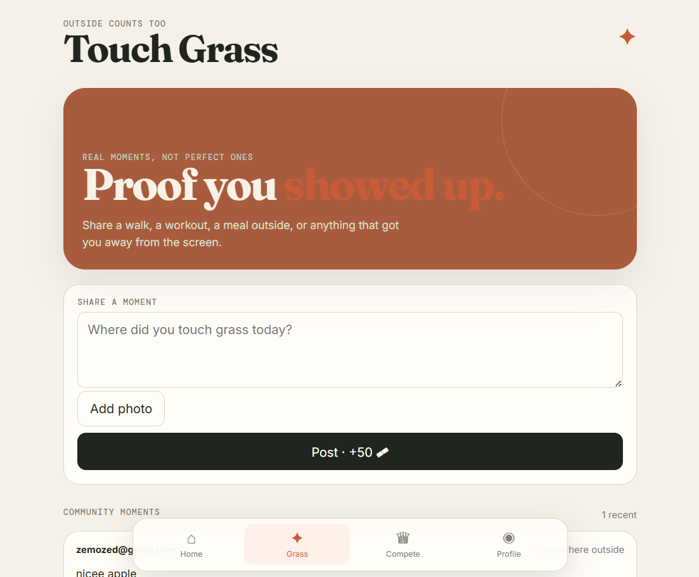
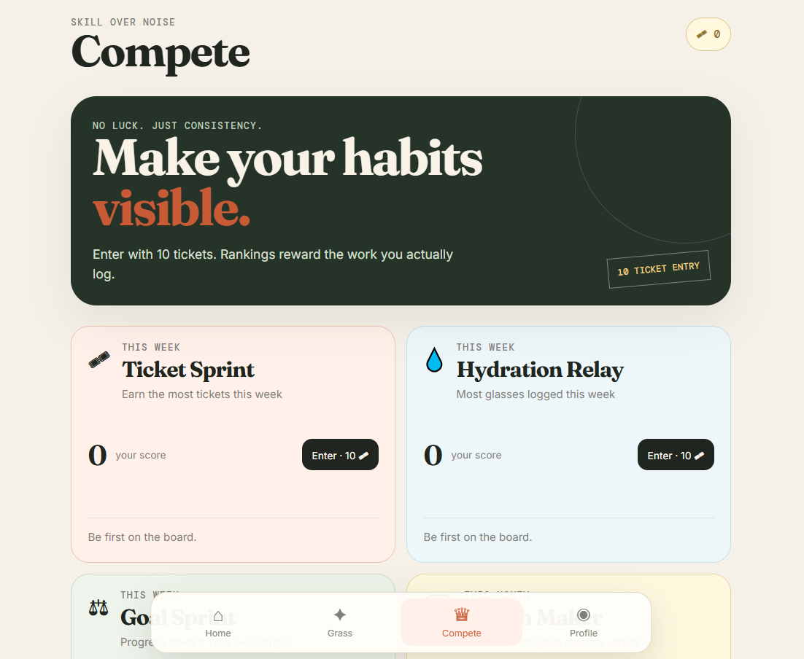
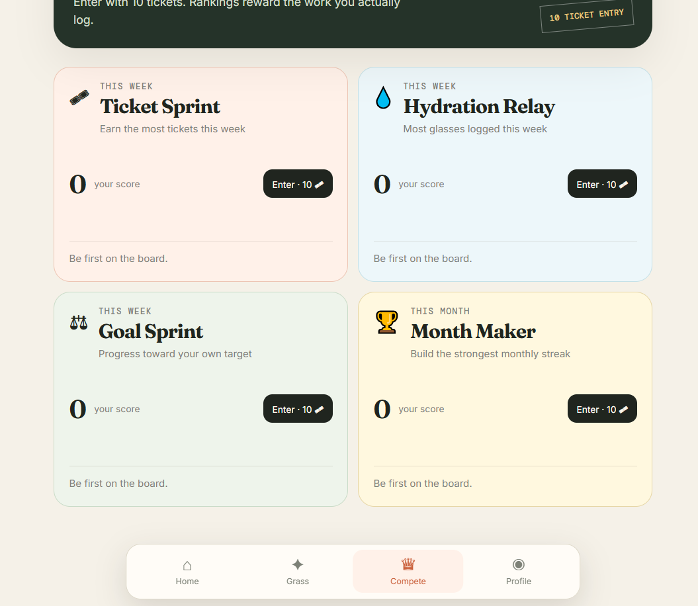

# NimiFit

> Log meals, touch grass, earn NIM — wellness that pays you back.

| Field | Value |
| --- | --- |
| Category | Health & fitness |
| Pricing | Freemium |
| Team name | _Not provided — optional_ |
| Team members | _Not provided — optional_ |
| X account | SimoFc10 |
| Contact email | zemoked@gmail.com |
| GitHub login | @birdcoin0 |
| Submitted at | 2026-07-31T23:14:15.238Z |

## Links

| Link | URL |
| --- | --- |
| Repo | [https://github.com/birdcoin0/nimifit-mini-app](<https://github.com/birdcoin0/nimifit-mini-app>) |
| Demo | [https://nimifit-mini-app.vercel.app/](<https://nimifit-mini-app.vercel.app/>) |
| Video | [https://nimifit-mini-app.vercel.app/](<https://nimifit-mini-app.vercel.app/>) |

## Description

NimiFit is a Nimiq Pay wellness app where every healthy habit earns tickets. Scan meals with Gemini AI, log water, and share your outdoor moments on Touch Grass — a social feed where real-life movement gets rewarded. Compete in weekly challenges and redeem tickets for Pro, or pay

## Builder story

_Not provided — optional_

## Thumbnail

## Screenshots

---

_Generated from the submission form. `submission.yaml` in this folder is the machine-readable source of truth._
