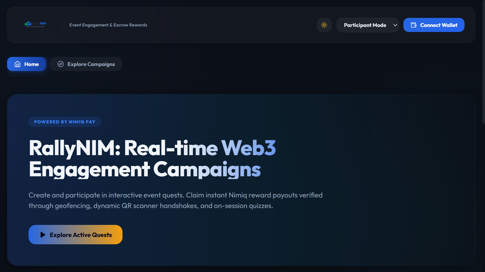
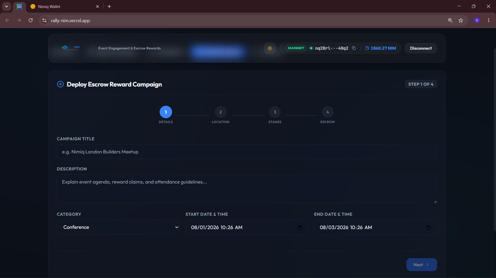
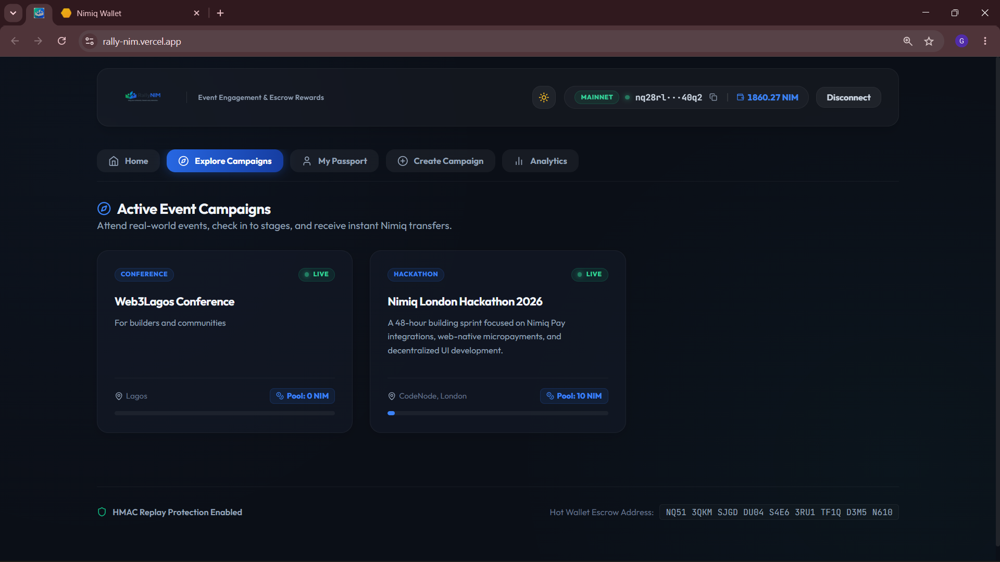
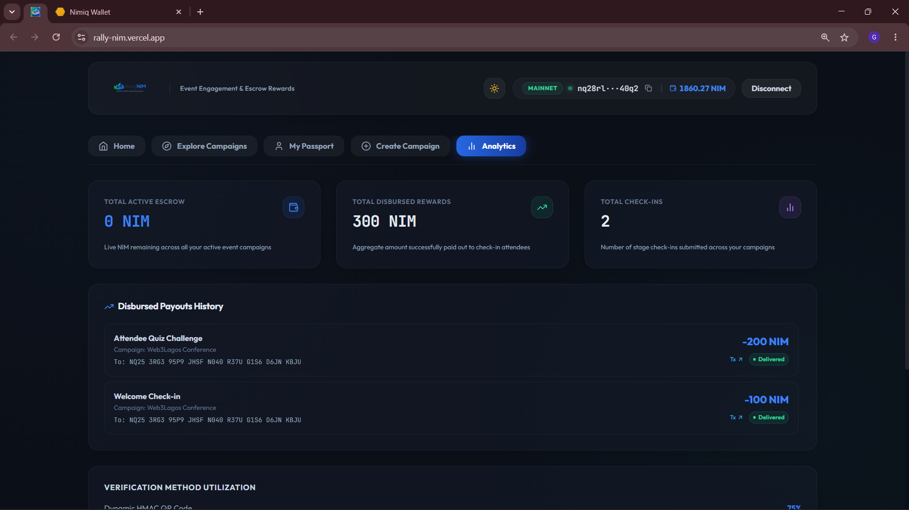
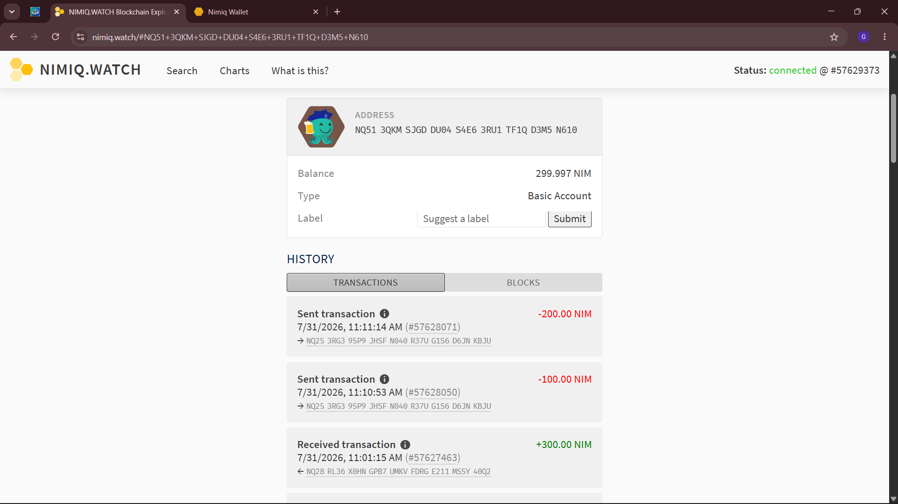

# RallyNIM

> Rally your community. Reward every interaction.

| Field | Value |
| --- | --- |
| Category | Productivity |
| Pricing | Free |
| Team name | _Not provided — optional_ |
| Team members | _Not provided — optional_ |
| X account | acunetixtech001 |
| Contact email | preciousadebisi2022@gmail.com |
| GitHub login | @devacunetixtech |
| Submitted at | 2026-07-31T13:12:50.704Z |

## Links

| Link | URL |
| --- | --- |
| Repo | [https://github.com/devacunetixtech/RallyNIM](<https://github.com/devacunetixtech/RallyNIM>) |
| Demo | [https://rally-nim.vercel.app/](<https://rally-nim.vercel.app/>) |
| Video | [https://youtu.be/dFKBx6jMTNA](<https://youtu.be/dFKBx6jMTNA>) |

## Description

RallyNIM is a Mini App that enables organisers to create smart reward campaigns for events, communities, hackathons, universities, and businesses. Participants complete activities, scan dynamic QR codes, and earn NIM rewards directly through MiniPay.

## Builder story

I'm a full-stack developer passionate about building products that solve real-world problems through Web3. While attending community events and hackathons, I noticed organisers often struggle to reward participation fairly, securely, and at scale. Existing solutions are fragmented, manual, or focused only on token distribution.

I built RallyNIM to make community engagement effortless. Organisers can launch smart reward campaigns in minutes, while participants simply connect their MiniPay wallet, complete activities, scan dynamic QR codes, and instantly earn NIM rewards.

Throughout this competition, I built in public, gathered feedback from the community, and focused on delivering a polished, production-ready Mini App rather than just a prototype. My goal is to help make MiniPay the go-to platform for rewarding real-world participation and community engagement.

## Thumbnail

## Screenshots

---

_Generated from the submission form. `submission.yaml` in this folder is the machine-readable source of truth._
