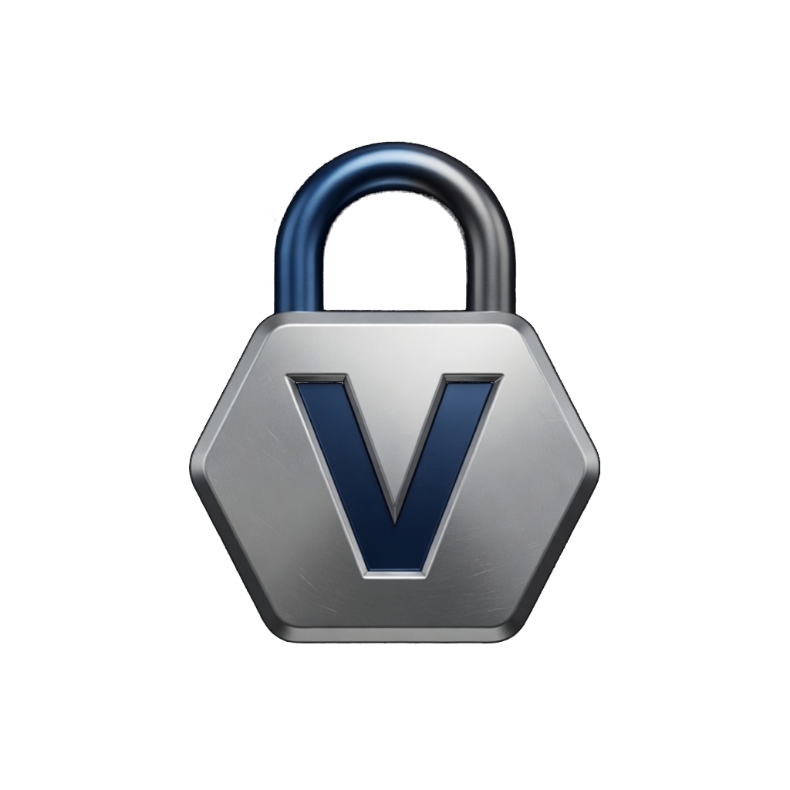
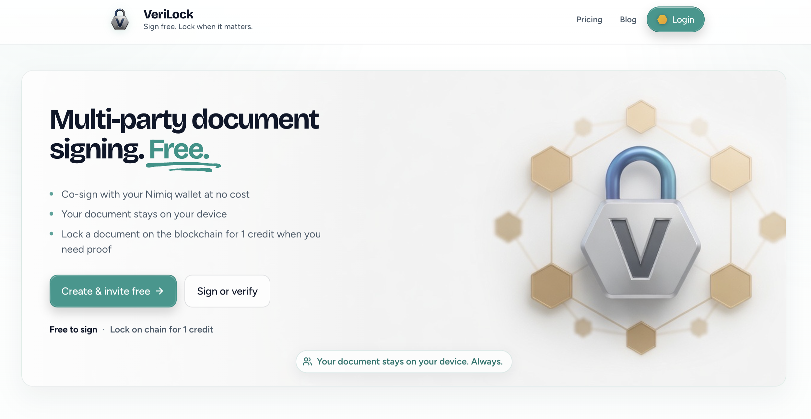
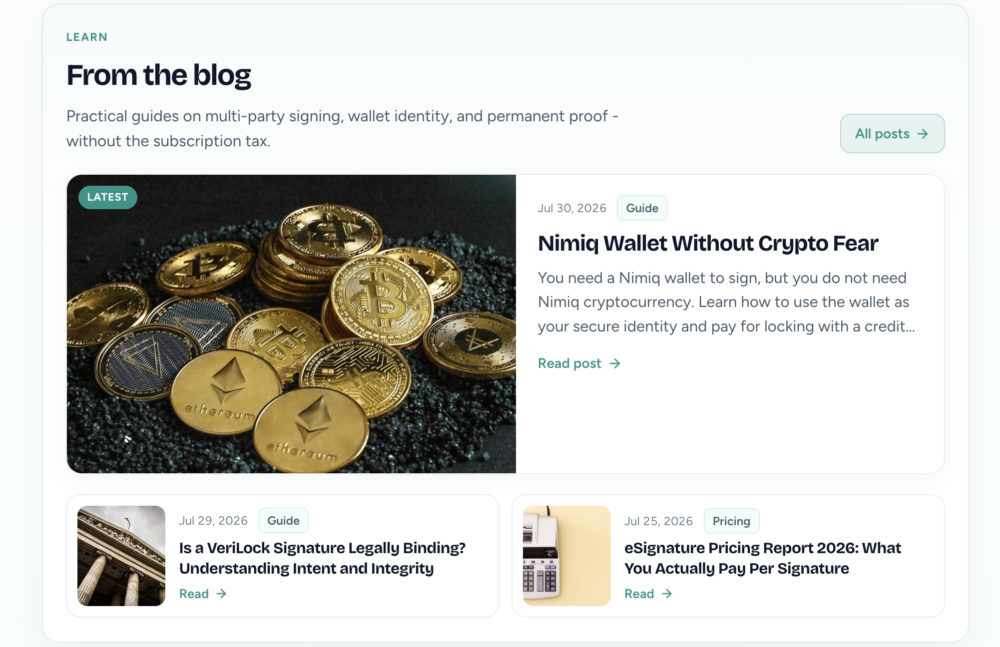
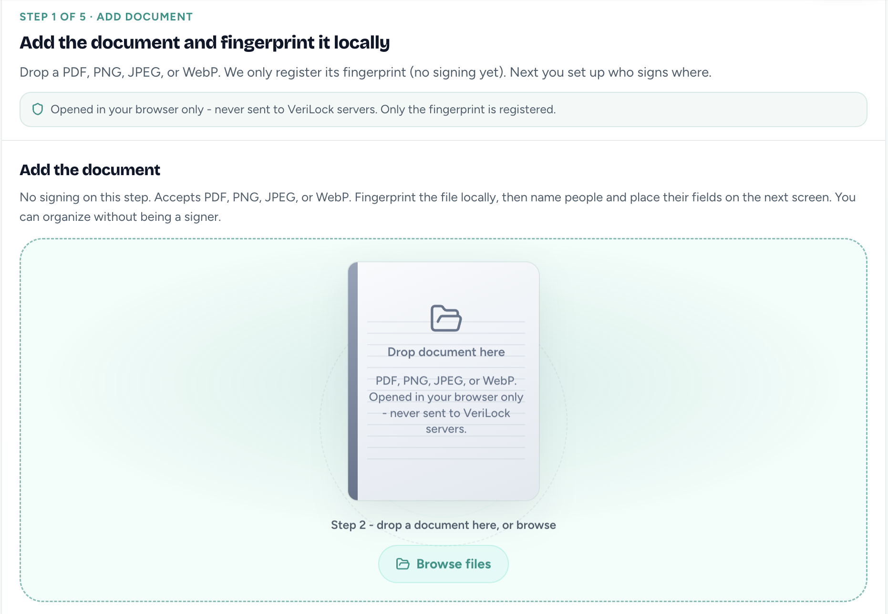
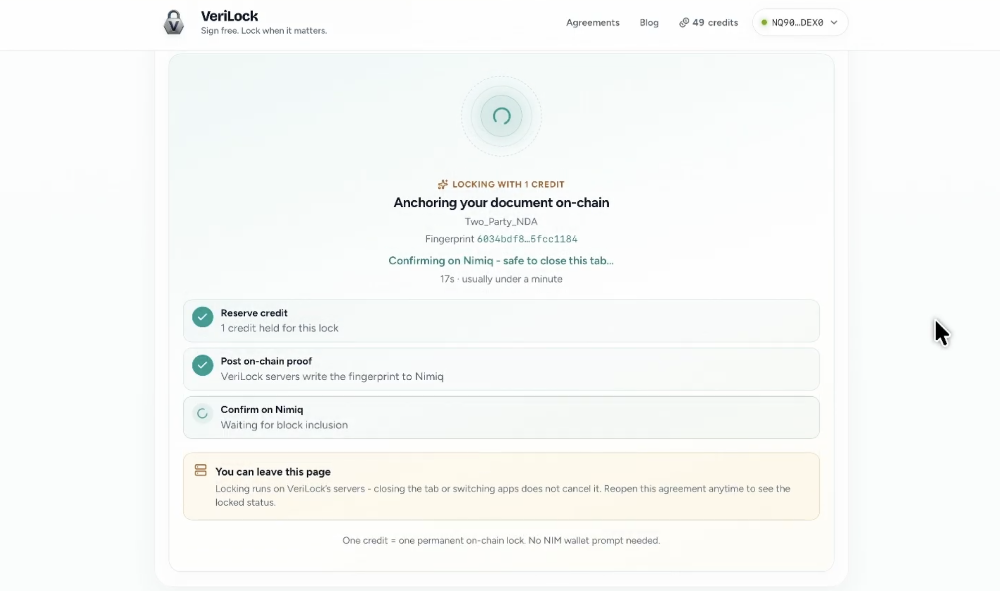
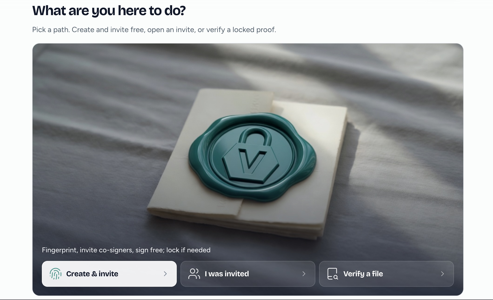

# VeriLock

> Sign Free. Lock when it matters.

| Field | Value |
| --- | --- |
| Category | Productivity |
| Pricing | Freemium |
| Team name | _Not provided — optional_ |
| Team members | _Not provided — optional_ |
| X account | verilockonline |
| Contact email | harmssam@gmail.com |
| GitHub login | @harmssam |
| Submitted at | 2026-07-31T21:38:06.697Z |

## Links

| Link | URL |
| --- | --- |
| Repo | [https://github.com/harmssam/verilock](<https://github.com/harmssam/verilock>) |
| Demo | [https://verilock.online/](<https://verilock.online/>) |
| Video | [https://youtu.be/I9OGrZvuXwY](<https://youtu.be/I9OGrZvuXwY>) |

## Description

VeriLock - Free multi-party document signing, with optional permanent proof on the Nimiq blockchain.

## Builder story

I built VeriLock after seeing how rental and freelance agreements get disputed months later - with no easy way to prove everyone signed the same document. Existing e-sign tools store your PDFs on their servers and charge monthly fees. VeriLock takes a different approach:  fingerprint the document locally, collect wallet-backed signatures from each party, and anchor the final hash on the Nimiq blockchain with a single fingerprint transaction. The file stays on your device, but the proof is permanent and publicly verifiable. I also created https://github.com/clevertech-os/verilock-offline so that if users decide to store their completed fields - signatures, text, they can recompile the contract using the original document.
I used Grok to ship the full stack - React
  mini app, Express API, SQLite on Railway - in time for the competition.

## Thumbnail

## Screenshots

---

_Generated from the submission form. `submission.yaml` in this folder is the machine-readable source of truth._
