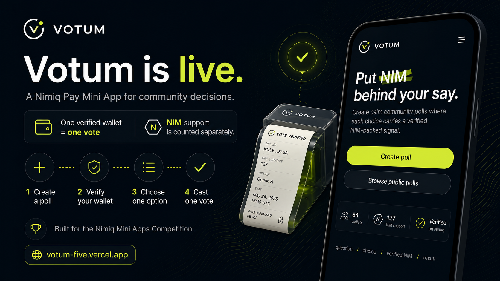
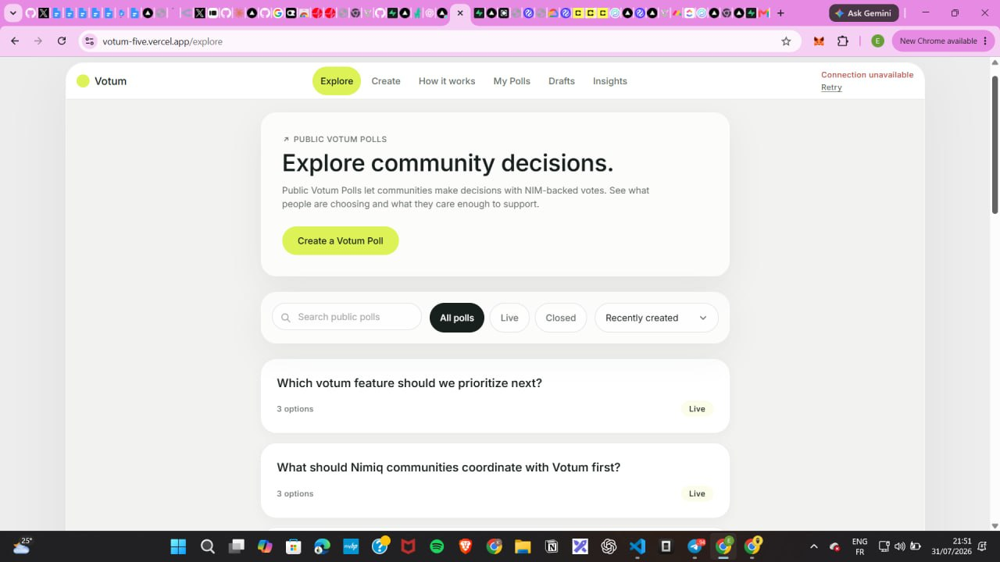
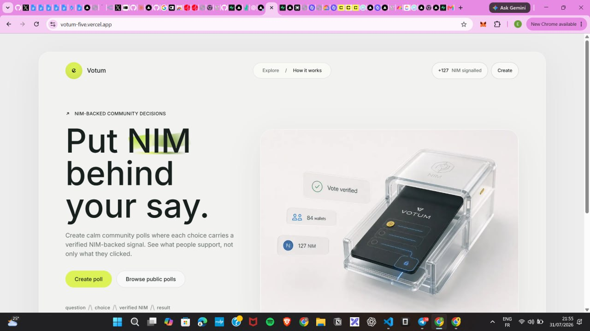
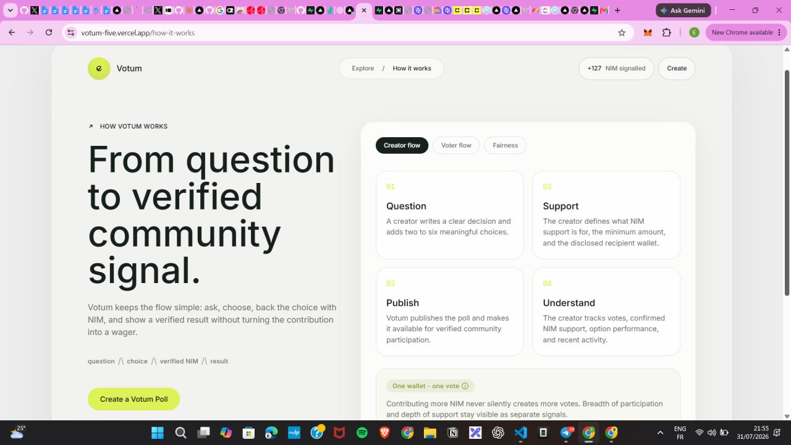

# Votum

> Your choice, verified

| Field | Value |
| --- | --- |
| Category | Social |
| Pricing | Free |
| Team name | _Not provided — optional_ |
| Team members | _Not provided — optional_ |
| X account | _Kaaelaa_ & @_votumm_ |
| Contact email | kaelah679@gmail.com |
| GitHub login | @kaelah971 |
| Submitted at | 2026-07-31T21:30:34.598Z |

## Links

| Link | URL |
| --- | --- |
| Repo | [https://github.com/kaelah971/votum](<https://github.com/kaelah971/votum>) |
| Demo | [https://votum-five.vercel.app/](<https://votum-five.vercel.app/>) |
| Video | [https://x.com/_votumm_/status/2083299284829508063?s=46](<https://x.com/_votumm_/status/2083299284829508063?s=46>) |

## Description

Votum is a Nimiq Pay Mini App for verified voting, where one wallet gets one vote and optional NIM support is counted separately. It helps creators and communities turn simple polls into accountable participation.

## Builder story

I built Votum because most online polls are easy to create, but difficult to trust.

A single person can vote more than once, participation is often anonymous, and the final number rarely shows how strongly people care about each option. At the same time, creators and communities often need a better way to involve their audiences in real decisions.

Nimiq Pay made it possible to approach this differently. I could verify participation through a wallet, enforce one vote per wallet, and allow people to optionally support the option they believe in with NIM.

That became Votum: a simple way to turn passive clicks into accountable participation.

What problem Votum solves

Votum helps creators, communities and organizations collect more trustworthy audience signals.

Each verified wallet gets one vote, so sending more money never creates more voting power. Optional NIM support is counted separately and sent directly to the disclosed recipient.

This allows creators to see two different signals clearly:

how many people chose an option;
how strongly people were willing to support it.

Votum also gives creators visibility into total votes, confirmed NIM support, option performance and recent activity.

The goal is to make online decisions more transparent, meaningful and useful without making participation complicated.

## Thumbnail

## Screenshots

---

_Generated from the submission form. `submission.yaml` in this folder is the machine-readable source of truth._
