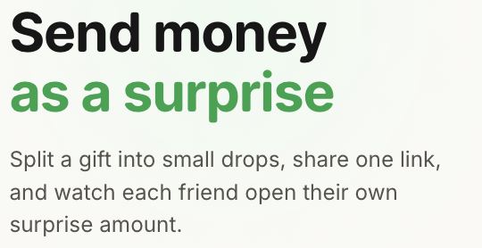
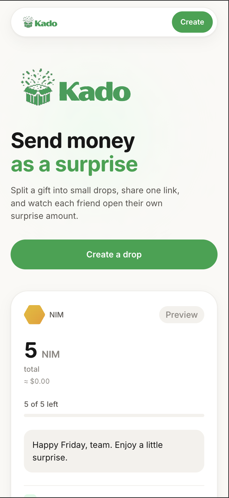
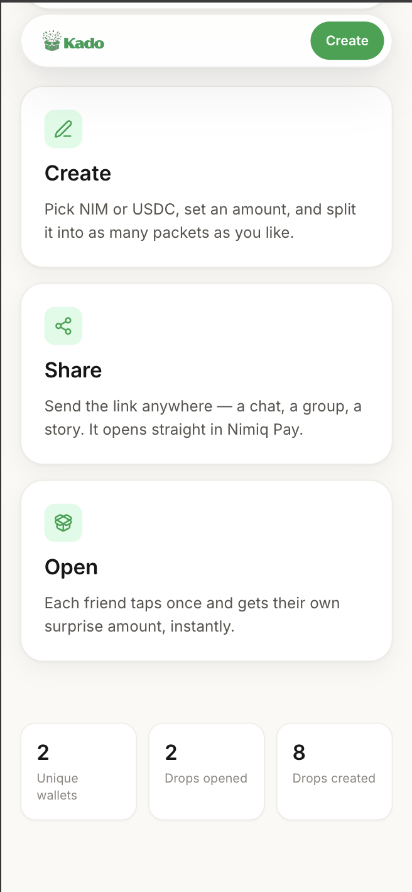
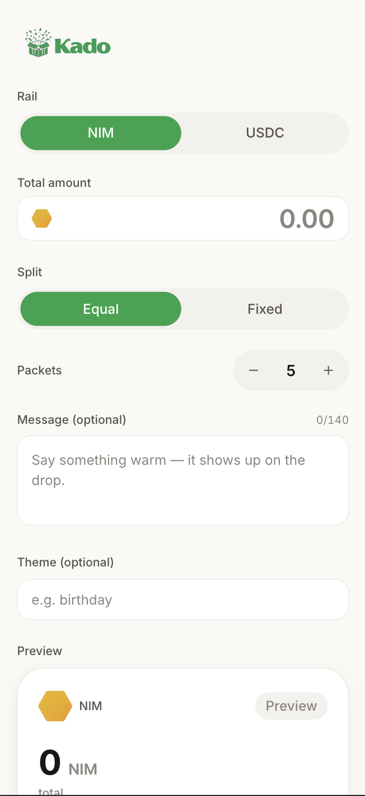

# Kado

> Gift a little money, drop a link. First to tap, first to claim — gasless, right inside Nimiq Pay.

| Field | Value |
| --- | --- |
| Category | Social |
| Pricing | Free |
| Team name | Kado |
| Team members | 1, Solo |
| X account | https://x.com/bappeettt |
| Contact email | capinho77@gmail.com |
| GitHub login | @louissarvin |
| Submitted at | 2026-07-31T23:25:53.780Z |

## Links

| Link | URL |
| --- | --- |
| Repo | [https://github.com/louissarvin/Kado](<https://github.com/louissarvin/Kado>) |
| Demo | [https://kado-nine-gold.vercel.app](<https://kado-nine-gold.vercel.app>) |
| Video | [https://youtu.be/t5q_Nkcv6M8](<https://youtu.be/t5q_Nkcv6M8>) |

## Description

Kado turns money into a shareable gift. Load NIM or USDC or USDT, split it into packets, and drop one link into the group chat. Recipients tap once to claim — gasless, no signup, no gas fee ever. First-come-first-served; whatever is left auto-refunds to you in 24 hours.

## Builder story

new web3 developer, wanted to build a fun, simple, and useful app for Nimiq Pay users. Kado is a gasless, no-signup way to gift money in a group chat. I built it in 2 weeks, and it was a blast to see it come together.

## Thumbnail

## Screenshots

---

_Generated from the submission form. `submission.yaml` in this folder is the machine-readable source of truth._
