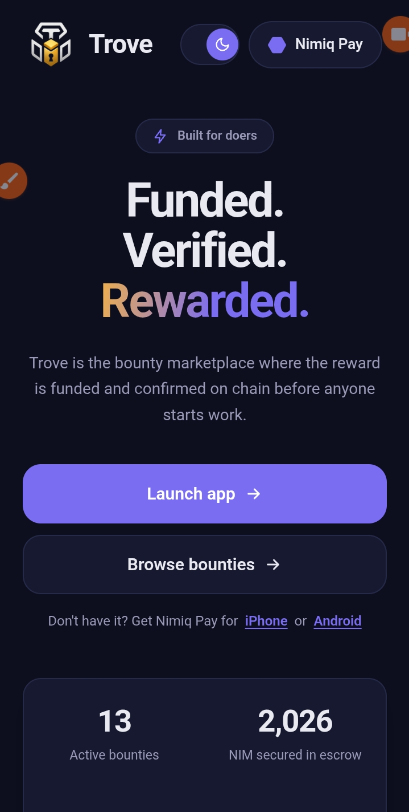
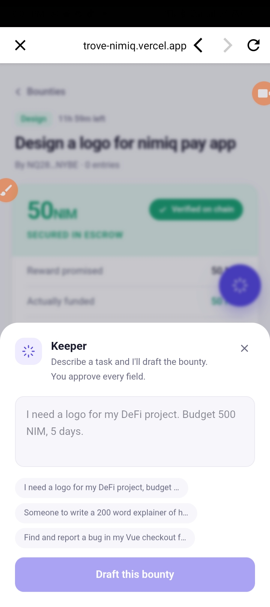
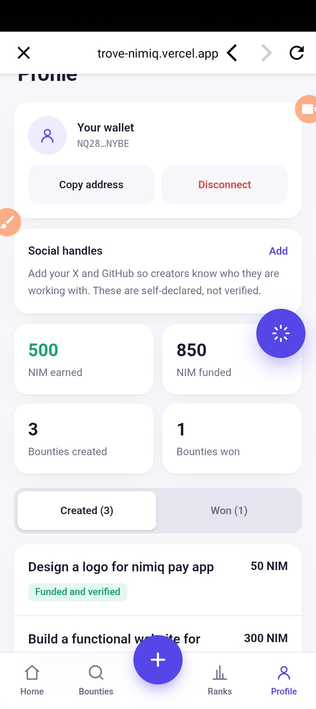
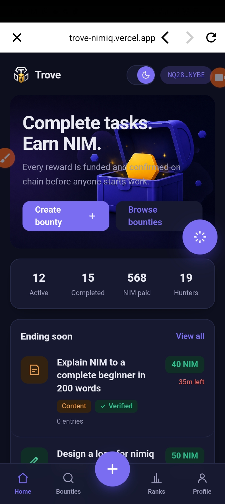
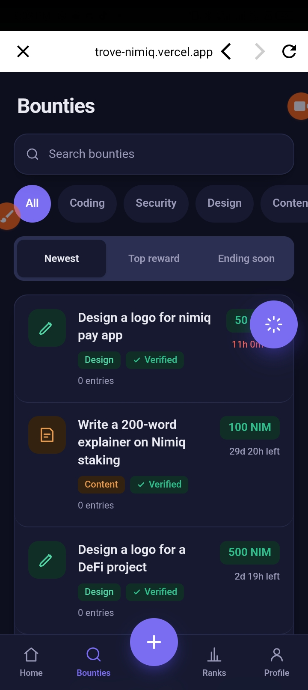
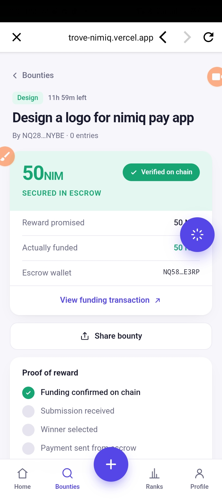

# Trove

> Funded bounties. Verified payouts.

| Field | Value |
| --- | --- |
| Category | Marketplaces |
| Pricing | Free |
| Team name | De_xklusiv |
| Team members | None |
| X account | De_xklusiv |
| Contact email | kareemtoheeba10@gmail.com |
| GitHub login | @mzterwalexzyy |
| Submitted at | 2026-07-31T20:06:35.249Z |

## Links

| Link | URL |
| --- | --- |
| Repo | [https://github.com/mzterwalexzyy/Trove](<https://github.com/mzterwalexzyy/Trove>) |
| Demo | [https://trove-nimiq.vercel.app](<https://trove-nimiq.vercel.app>) |
| Video | [https://youtube.com/shorts/v0x1xVZQGpM?is=oyuOnAsQmXjXWK2d](<https://youtube.com/shorts/v0x1xVZQGpM?is=oyuOnAsQmXjXWK2d>) |

## Description

TROVE is a Nimiq Pay Mini App for posting, discovering, and completing funded bounties, with rewards verified on-chain before work begins.

## Builder story

TROVE was inspired by a simple question: why should small tasks require complicated platforms, and why should hunters have to trust they'll get paid?

I built TROVE to make bounties simple, mobile-first, and verifiable through Nimiq Pay.

## Thumbnail

## Screenshots

---

_Generated from the submission form. `submission.yaml` in this folder is the machine-readable source of truth._
