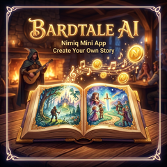
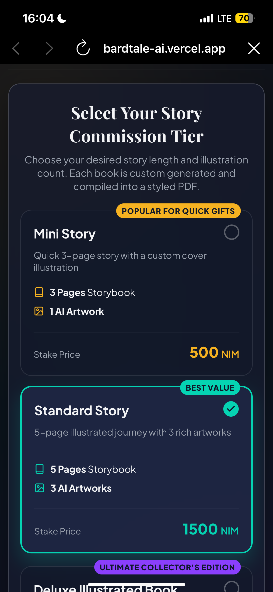
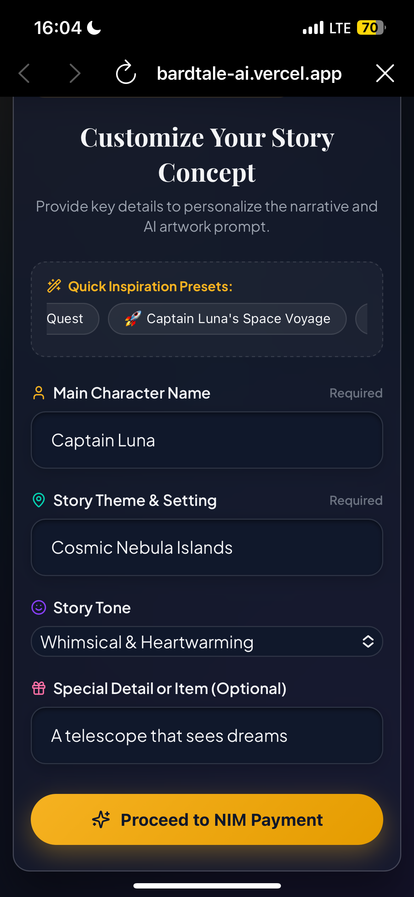
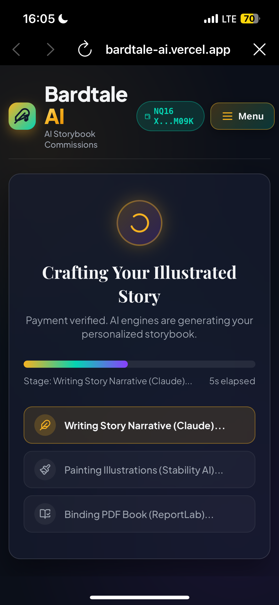
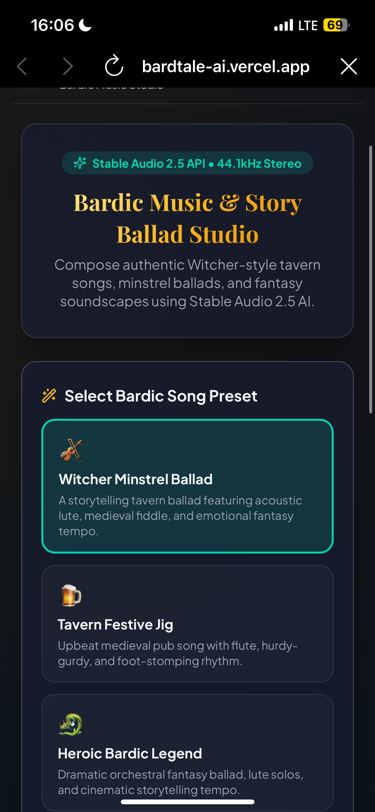
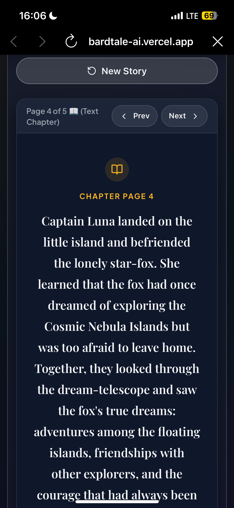

# Bardtale Studio

> Create Storybooks, Custom Artworks & Witcher-Style Bardic Ballads

| Field | Value |
| --- | --- |
| Category | Creator tools |
| Pricing | Paid |
| Team name | _Not provided — optional_ |
| Team members | _Not provided — optional_ |
| X account | _Not provided — optional_ |
| Contact email | edidionguwemedimo3@gmail.com |
| GitHub login | @nimrid |
| Submitted at | 2026-07-31T15:36:30.279Z |

## Links

| Link | URL |
| --- | --- |
| Repo | [https://github.com/nimrid/Bardtale-AI](<https://github.com/nimrid/Bardtale-AI>) |
| Demo | [https://bardtale-ai.vercel.app/](<https://bardtale-ai.vercel.app/>) |
| Video | [https://youtube.com/shorts/SQE6CmZC9Ig?si=zN-_mw0BSIHXqCcB](<https://youtube.com/shorts/SQE6CmZC9Ig?si=zN-_mw0BSIHXqCcB>) |

## Description

Create personalized short intriguing stories and artwork. Compose authentic Witcher-style tavern songs, minstrel ballads, and fantasy soundscapes up to 3 minutes.

## Builder story

_Not provided — optional_

## Thumbnail

## Screenshots

---

_Generated from the submission form. `submission.yaml` in this folder is the machine-readable source of truth._
