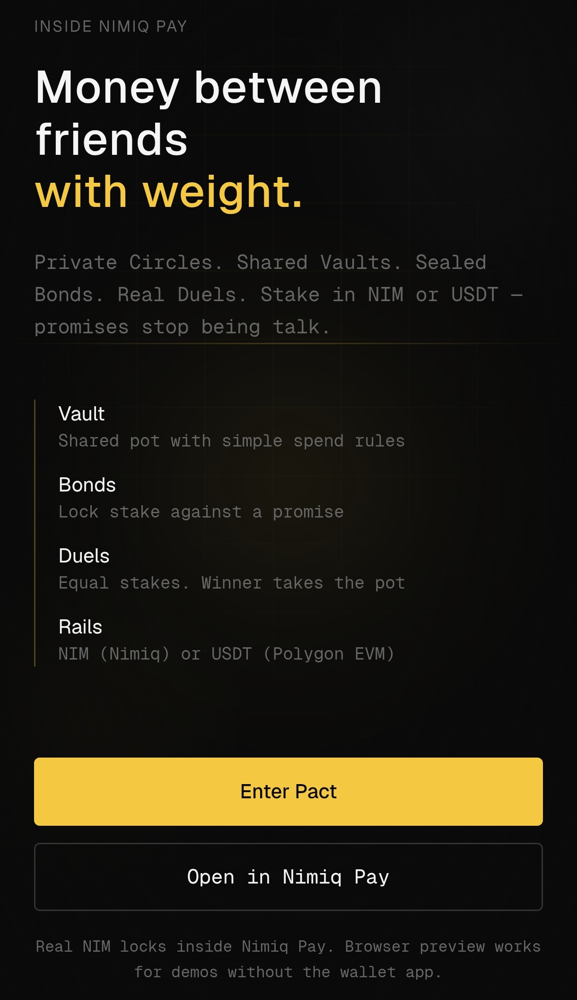
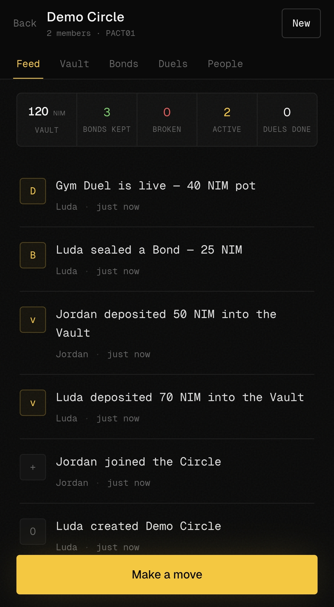
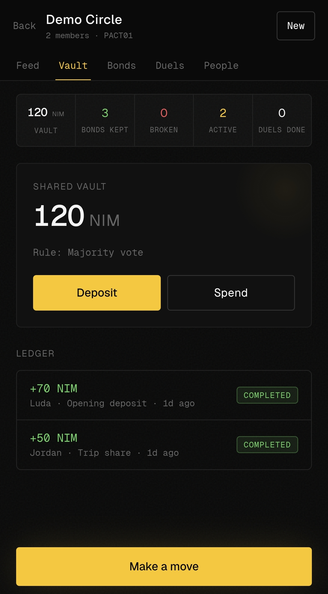
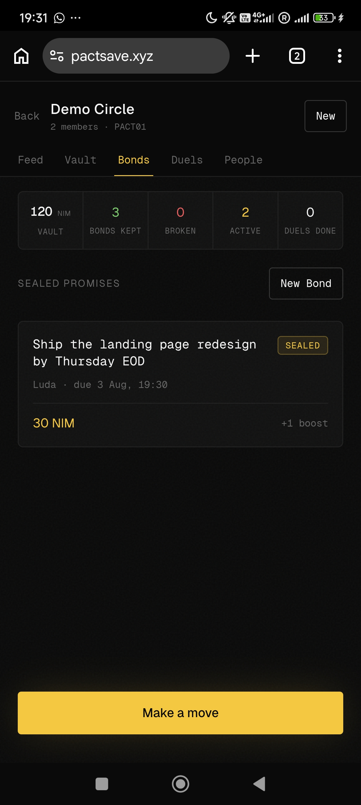
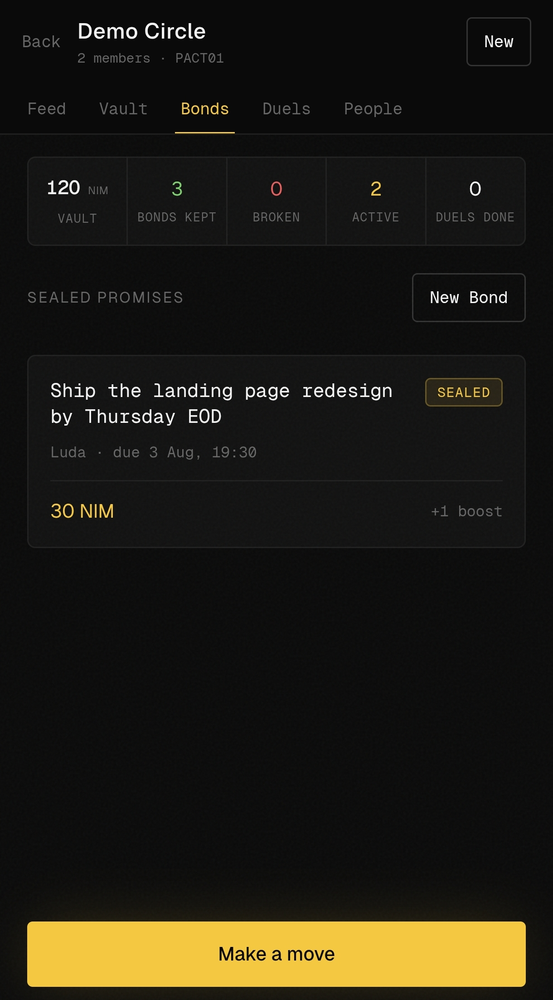

# Pact

> Money between friends, with weight.

| Field | Value |
| --- | --- |
| Category | Social |
| Pricing | Free |
| Team name | _Not provided — optional_ |
| Team members | _Not provided — optional_ |
| X account | Ludarep |
| Contact email | ludaluda134@gmail.com |
| GitHub login | @rudazy |
| Submitted at | 2026-07-31T18:35:15.301Z |

## Links

| Link | URL |
| --- | --- |
| Repo | [https://github.com/rudazy/Pact](<https://github.com/rudazy/Pact>) |
| Demo | [https://pactsave.xyz](<https://pactsave.xyz>) |
| Video | [https://youtube.com/shorts/xOCZ1_s2Ls4](<https://youtube.com/shorts/xOCZ1_s2Ls4>) |

## Description

Pact is a Mini App inside Nimiq Pay where friends stake real NIM on promises, pool a shared vault, and settle challenges head to head. It's for anyone tired of chasing friends over money, accountability you can actually feel, not just a bill tracker.

## Builder story

We all have that one friend who "definitely" pays you back Friday, then Friday becomes next week, and bringing it up makes you the awkward one. So you just eat it and keep score in your head.

Pact fixes that. It's a Mini App inside Nimiq Pay where money between friends carries weight. Instead of tracking who owes what after the fact, you put something on the line before it happens. Lock real NIM behind a promise, keep it and your stake returns, break it and it goes to the group. Pool a shared vault the whole Circle controls. Settle challenges head to head where the winner takes the pot.

It's not a bill splitter. It's accountability you can actually feel, built for the people who already trust each other.

## Thumbnail

## Screenshots

---

_Generated from the submission form. `submission.yaml` in this folder is the machine-readable source of truth._
