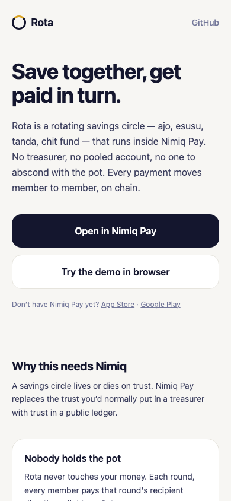
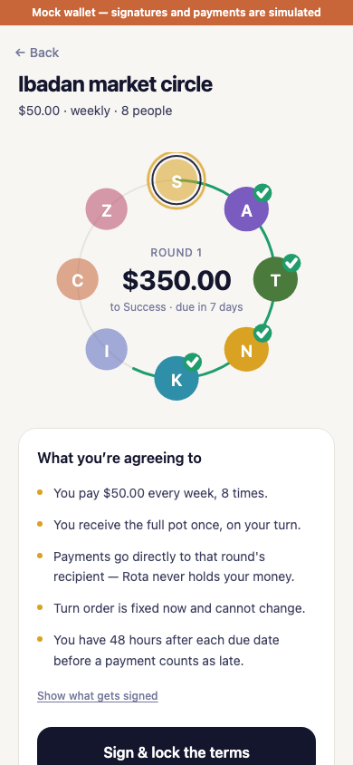
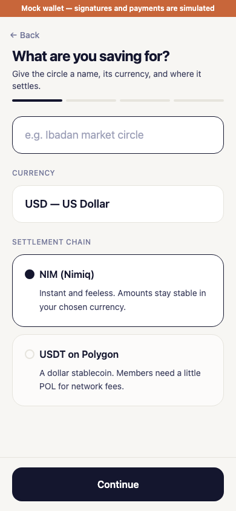
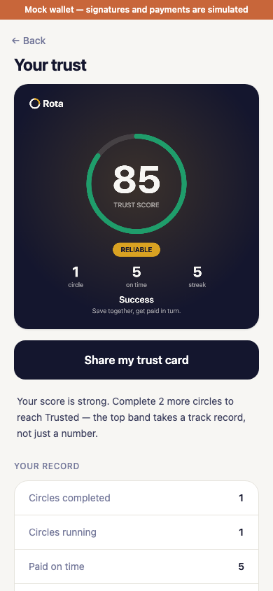

# Rota

> Save together, get paid in turn -  no treasurer required

| Field | Value |
| --- | --- |
| Category | Earning |
| Pricing | Free |
| Team name | Rota Team |
| Team members | Etuwoke Favour |
| X account | finishr |
| Contact email | successaje7@gmail.com |
| GitHub login | @successaje |
| Submitted at | 2026-07-31T22:46:52.132Z |

## Links

| Link | URL |
| --- | --- |
| Repo | [https://github.com/successaje/Rota](<https://github.com/successaje/Rota>) |
| Demo | [https://rota-pearl.vercel.app](<https://rota-pearl.vercel.app>) |
| Video | [https://youtu.be/UkLw-tnowps](<https://youtu.be/UkLw-tnowps>) |

## Description

Rota brings ajo, esusu, and tanda rotating savings circles on-chain. Each round, members pay each other directly — Rota never holds the pot. Turn order is fixed or price-bid, never random, and a portable Trust Score tracks who pays on time across circles.

## Builder story

This started with a very ordinary problem. In school, I had steady pocket money, but never enough saved up when I actually needed something big, like a laptop. A loan meant paying interest on money I didn't have yet, so instead I just saved toward it, a little at a time, until I could buy it outright. Slower, but mine, and free of debt.
Then I thought: what if I didn't have to do that alone? If a group of us contributed together, each round, and one person collected the full amount in turn, we'd all get there faster, with nobody borrowing from a bank. Well, it wasn't a new idea at all. It's ajo, esusu, tanda, chit funds, communities everywhere have done this for generations, just with cash and a lot of trust in each other.

That trust is usually where it falls apart, though,  someone disappears with the pot, or stops paying once it's their turn. Rota is that same schoolyard idea, just built so the trust doesn't have to be blind anymore. Everyone pays each other directly, on-chain, so nobody has to hold the group's money,  and nobody has to just take someone's word for it.

## Thumbnail

## Screenshots

---

_Generated from the submission form. `submission.yaml` in this folder is the machine-readable source of truth._
