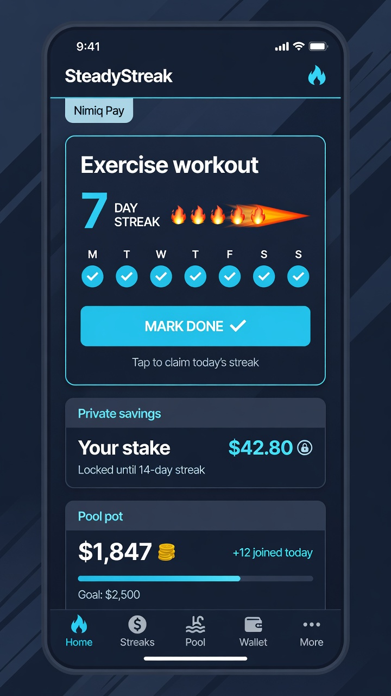
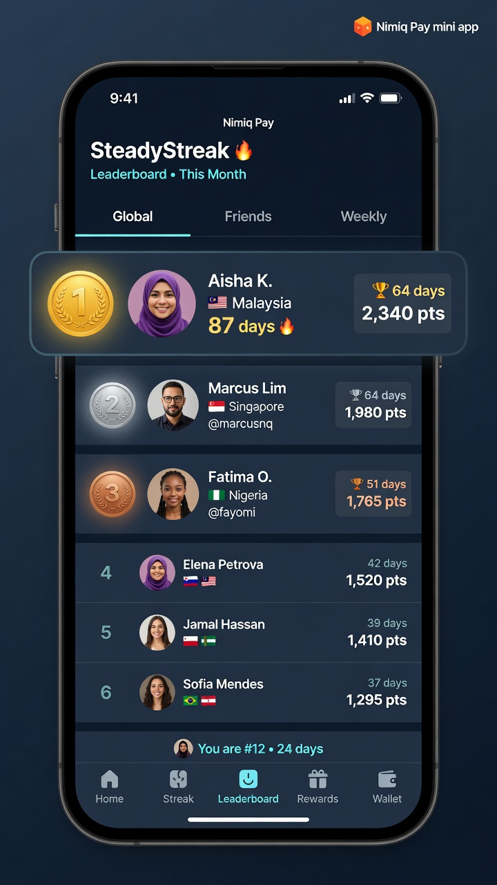
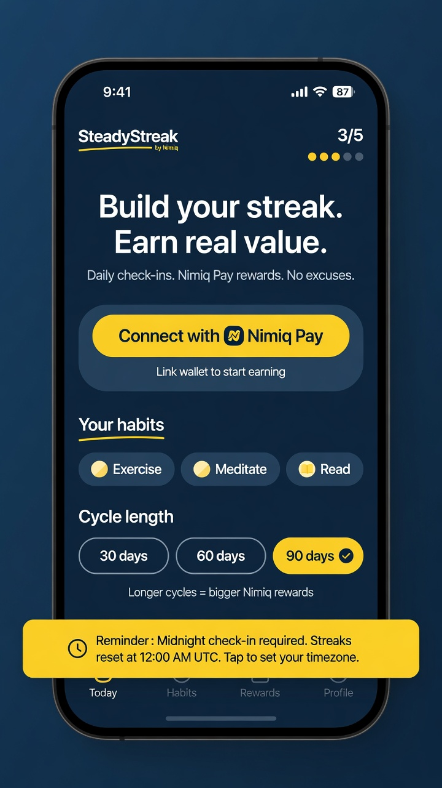

# SteadyStreak

> Build habits. Save NIM safely. Stake only what you’ll risk.

| Field | Value |
| --- | --- |
| Category | Lifestyle |
| Pricing | Free |
| Team name | _Not provided — optional_ |
| Team members | _Not provided — optional_ |
| X account | Emeka_builds |
| Contact email | ogbonnaemeka543@gmail.com |
| GitHub login | @tiberius-ls |
| Submitted at | 2026-07-31T15:57:23.500Z |

## Links

| Link | URL |
| --- | --- |
| Repo | [https://github.com/tiberius-ls/SteadyStreak](<https://github.com/tiberius-ls/SteadyStreak>) |
| Demo | [https://steadystreak.vercel.app](<https://steadystreak.vercel.app>) |
| Video | [https://x.com/Emeka_builds/status/2083218157334876431?s=20](<https://x.com/Emeka_builds/status/2083218157334876431?s=20>) |

## Description

Daily habit streaks in Nimiq Pay: each check-in sends safe savings plus a stake. Miss a day, and the stake goes to a shared pool; survivors split it. For anyone who wants accountability with real NIM, not just a streak counter.

## Builder story

I'm Chukwuemeka, the "student paramedic who codes."

In emergency medicine, consistency isn't optional. You don't get to skip the protocol because you're not feeling it. But outside the clinical world? I struggle with the same habit consistency everyone does. Rotations eat my schedule, and the first thing to slip is always the habit I actually care about.

Every streak app I've tried relies on motivation showing up when you need it. It rarely does.

So I built SteadyStreak: put real NIM behind your streak. Break it, you lose your stake. Finish it, you split the pool with everyone else who stayed consistent. It's the same principle paramedics live by; show up every time, not just when you feel like it, just applied to daily habits instead of emergencies.

Built solo on Nimiq Pay's Mini App Framework for Cycle I of the competition. v1 is live. More coming.

## Thumbnail

## Screenshots

---

_Generated from the submission form. `submission.yaml` in this folder is the machine-readable source of truth._
