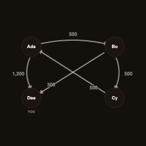
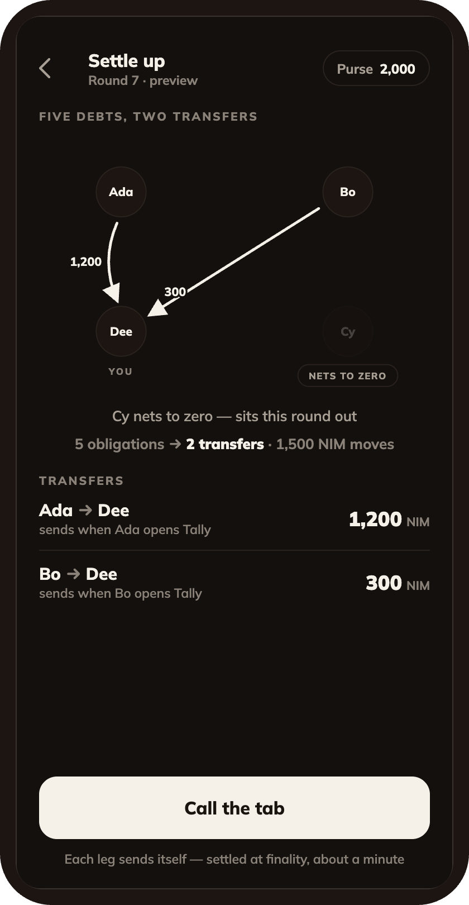
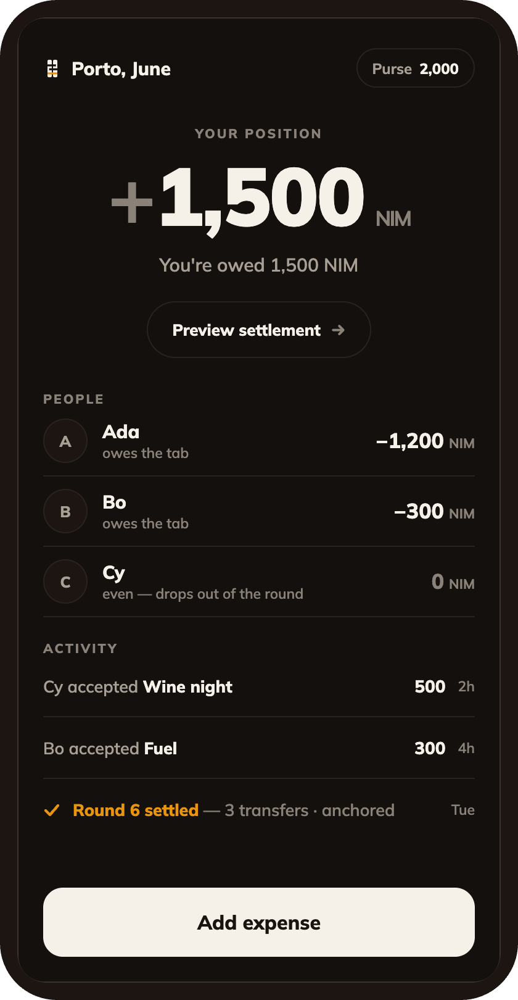
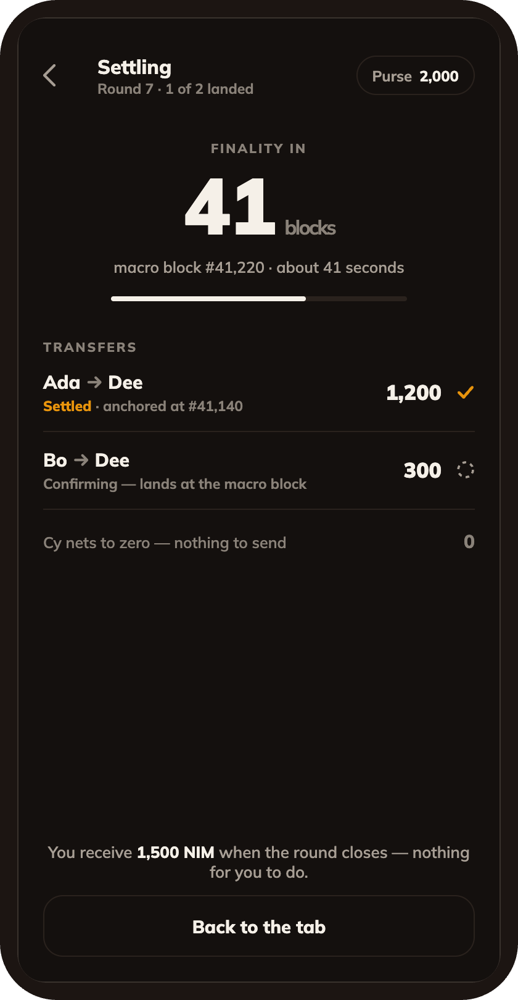
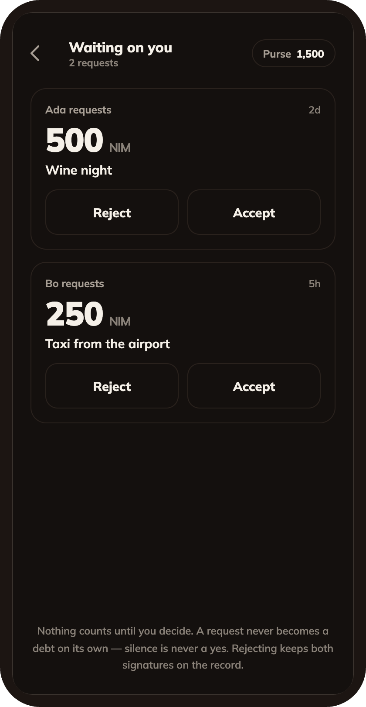
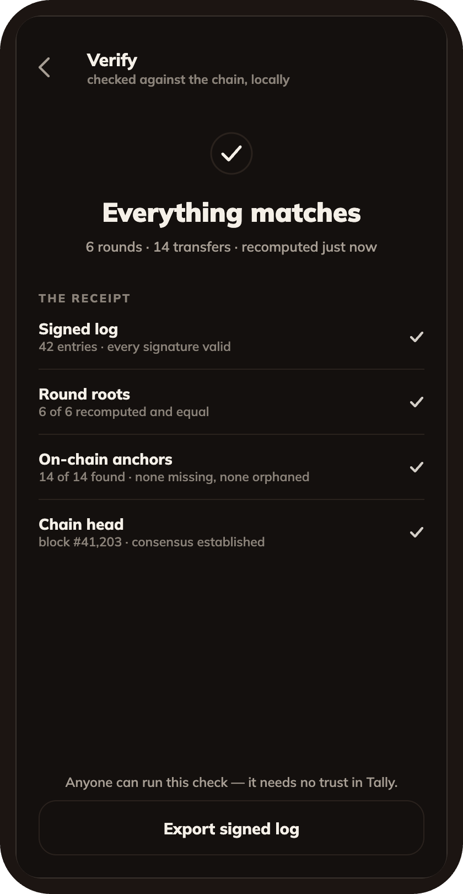

# Tally

> Top up once. Stop settling up.

| Field | Value |
| --- | --- |
| Category | Social |
| Pricing | Free |
| Team name | Tally |
| Team members | _Not provided — optional_ |
| X account | winsznx |
| Contact email | xidoncapitals@gmail.com |
| GitHub login | @winsznx |
| Submitted at | 2026-07-31T23:57:12.344Z |

## Links

| Link | URL |
| --- | --- |
| Repo | [https://github.com/winsznx/tally](<https://github.com/winsznx/tally>) |
| Demo | [https://tally-646.pages.dev/](<https://tally-646.pages.dev/>) |
| Video | [https://tally-646.pages.dev/demovideo](<https://tally-646.pages.dev/demovideo>) |

## Description

A shared tab for any group that spends together. Tally nets everyone's debts down to the fewest possible transfers and clears them in NIM without a payment prompt.

## Builder story

A tally stick was how debt worked before contracts. Notches cut across a piece of wood, then split lengthwise so each party kept a matching half, and neither could shave a notch without the other's half exposing it. I wanted the same property: a shared record neither side can quietly edit. The chain provides the notches. Nimiq being feeless is what makes it possible to settle the tab in amounts small enough that people actually bother.

## Thumbnail

## Screenshots

---

_Generated from the submission form. `submission.yaml` in this folder is the machine-readable source of truth._
